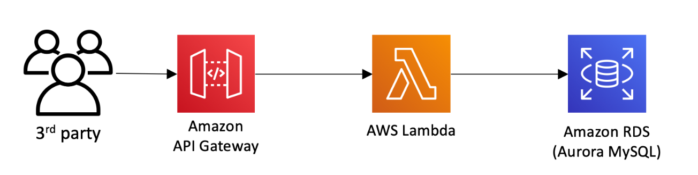

# Serverless Security Workshop

## Overview

In this workshop, you will learn techniques to secure a serverless application built with **AWS Lambda**, **Amazon API Gateway**, and **RDS Aurora**. We will cover AWS services and features you can leverage to improve the security of serverless applications in **5 domains**:

- **Identity & Access Management** - Implement authentication, authorization, and least privilege principles
- **Code** - Scan for dependency vulnerabilities and apply code security best practices
- **Data** - Encrypt data in transit and at rest, secure credential management
- **Infrastructure** - Apply WAF rules, implement rate limiting, and network security
- **Logging & Monitoring** - Enable comprehensive logging, tracing, and visibility

### Workshop Scenario

You'll start by deploying a simple serverless application that allows third-party companies to submit **unicorn customizations**. This will help Wild Rydes receive ad revenue and allow third-party companies to market their brand leveraging Wild Rydes's popularity.

### Initial Architecture

The simple serverless application starts with a basic architecture consisting of:
- AWS Lambda functions for business logic
- Amazon API Gateway as the REST API endpoint
- RDS Aurora database for data persistence

## The Security Challenge

However, this simple serverless application is **not very secure**, and we need your help to implement measures to protect this serverless API from attackers.

Common vulnerabilities in this initial architecture include:
- Exposed API endpoints with no authentication
- Hardcoded credentials in the application code
- Lack of input validation and SQL injection protection
- No rate limiting or DDoS protection
- Missing encryption for sensitive data
- Insufficient logging and monitoring

## Workshop Modules

By following different modules covering various aspects of security, you will help improve the security of the simple serverless application:

| Module | Topic | Focus Area |
|--------|-------|-----------|
| Module 0 | Initial Setup | Foundation & Prerequisites |
| Module 1 | Authentication & Authorization | Identity & Access |
| Module 2 | Lambda IAM | Access Control |
| Module 3 | Verified Permissions | Authorization as a Service |
| Module 4 | Secrets Management | Data Security |
| Module 5 | Input Validation | Code Security |
| Module 6 | Dependency Vulnerability | Code Security |
| Module 7 | Amazon Inspector | Infrastructure |
| Module 8 | Encryption in Transit | Data Security |
| Module 9 | Usage Plans & Rate Limiting | Infrastructure |
| Module 10 | WAF Protection | Infrastructure |
| Module 12 | X-Ray Tracing | Logging & Monitoring |

## Workshop Duration & Prerequisites

**Expected Duration:** Approximately **3 hours** to complete all modules

**Prerequisites:**
- AWS Account with appropriate permissions
- Basic knowledge of AWS services (Lambda, API Gateway, RDS)
- Familiarity with JavaScript/Node.js
- Understanding of REST APIs and OAuth concepts
---

**Note:** This is an advanced security workshop. It's recommended to have some prior experience with AWS services before starting.
