# Module 3: Amazon Verified Permissions

## Overview

- Monolithic applications typically have centralized permissions in code

- Distributed microservices spread permissions and logs across multiple services

- This distributed model loses central control and makes auditing difficult

- Authorization-as-a-service regains centralized access control and logging

- It enables iteration on least privilege principles

- It implements zero trust architecture

- It makes applications audit-friendly and AI-ready

### What is Amazon Verified Permissions?

- AVP is an authorization-as-a-service solution

- It replaces custom application-specific authorization systems

- Applications or enforcement points (like API Gateway) call AVP to check access

- AVP determines if a user can access a resource based on policies

### Architecture

1. Partner Admin API uses AVP Quick Start for rapid authorization enforcement

2. The architecture includes:
    - Cognito Users and Groups
    - Amazon Verified Permissions Policy Store
    - API Gateway with AVP Authorizer
    - Partner Admin API enforcement

  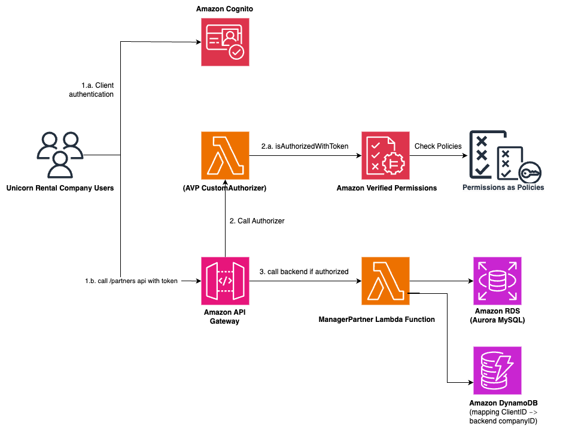

## Module 3A: Add Partner Users to Cognito Groups

### Part 1: Update CloudFormation Template

1. Open VS Code and navigate to `src/template.yaml`

2. Add the following CloudFormation resources to the Resources section:

  ```yaml

# Unicorn Partner API and Cognito resources - AVP Module
  CognintoUserPoolGroupAdmin:
   Type: AWS::Cognito::UserPoolGroup
   Properties:
    Description: Admin user group to manage partners
    GroupName: admin-users
    UserPoolId: !Ref CognitoUserPool
  CognitoUserPoolGroupPowerUser:
   Type: AWS::Cognito::UserPoolGroup
   Properties:
    Description: Power user group with limited admin access
    GroupName: power-users
    UserPoolId: !Ref CognitoUserPool
  UserPoolClient:
   Type: AWS::Cognito::UserPoolClient
   Properties:
    ClientName: avp-admin-client
    GenerateSecret: false
    UserPoolId: !Ref CognitoUserPool
    ExplicitAuthFlows:
     - ADMIN_NO_SRP_AUTH
     - USER_PASSWORD_AUTH
  UnicornPartnerApi:
   Type: AWS::Serverless::Api
   Properties:
    StageName: dev
    DefinitionBody:
     swagger: "2.0"
     info:
      title: UnicornPartnerAPI-AVP-Module
      description: Wild Ryde API for describing and managing unicorn partners for the AVP module
      version: 1.0.0
     paths:
      "/partners":
       post:
        x-amazon-apigateway-integration:
         httpMethod: POST
         type: aws_proxy
         uri:
          Fn::Sub: arn:aws:apigateway:${AWS::Region}:lambda:path/2015-03-31/functions/${ManagePartnerFunction.Arn}/invocations
        responses: {}
       options:
        consumes:
        - "application/json"
        responses:
         "200":
          description: "200 response"
          headers:
           Access-Control-Allow-Origin:
            type: "string"
           Access-Control-Allow-Methods:
            type: "string"
           Access-Control-Allow-Headers:
            type: "string"
        x-amazon-apigateway-integration:
         responses:
          default:
           statusCode: "200"
           responseParameters:
            method.response.header.Access-Control-Allow-Methods: "'OPTIONS,POST,GET'"
            method.response.header.Access-Control-Allow-Headers: "'Content-Type,X-Amz-Date,Authorization,X-Api-Key,X-Amz-Security-Token'"
            method.response.header.Access-Control-Allow-Origin: "'*'"
         requestTemplates:
          application/json: "{\"statusCode\": 200}"
         passthroughBehavior: "when_no_match"
         type: "mock"
     x-amazon-apigateway-gateway-responses:
      DEFAULT_5XX:
       responseParameters:
        gatewayresponse.header.Access-Control-Allow-Methods: "'GET,OPTIONS'"
        gatewayresponse.header.Access-Control-Allow-Origin: "'*'"
        gatewayresponse.header.Access-Control-Allow-Headers: "'Content-Type,X-Amz-Date,Authorization,X-Api-Key,X-Amz-Security-Token'"
      DEFAULT_4XX:
       responseParameters:
        gatewayresponse.header.Access-Control-Allow-Methods: "'GET,OPTIONS'"
        gatewayresponse.header.Access-Control-Allow-Origin: "'*'"
        gatewayresponse.header.Access-Control-Allow-Headers: "'Content-Type,X-Amz-Date,Authorization,X-Api-Key,X-Amz-Security-Token'"
  ```

  

3. Add the Lambda function event for AVP under ManagePartnerFunction:

  ```yaml
  CreatePartnerAVP:
    Type: Api
    Properties:
      Path: /partners
      Method: post
      RestApiId:
        Ref: UnicornPartnerApi
  ```

  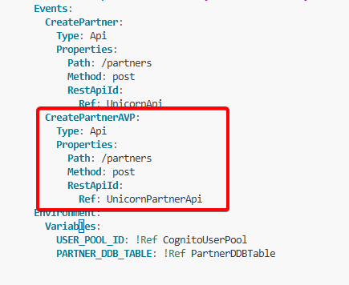

4. Add outputs to the template file at the end:

  ```yaml
  AVPApiURL:
    Description: "API endpoint URL for dev environment"
    Value: !Sub "https://${UnicornPartnerApi}.execute-api.${AWS::Region}.amazonaws.com/dev/"
  ```

  

5. Save the `src/template.yaml` file

6. Open a terminal and navigate to the src folder

  ```bash
  cd /Workshop/src
  ```

7. Validate the SAM template

  ```bash
  sam validate -t template.yaml --region $REGION
  ```

8. Deploy the updated stack

  ```bash
  aws cloudformation package --output-template-file packaged.yaml --template-file template.yaml --s3-bucket $DeploymentS3Bucket --s3-prefix securityworkshop --region $REGION && aws cloudformation deploy --template-file packaged.yaml --stack-name CustomizeUnicorns --region $REGION --capabilities CAPABILITY_IAM
  ```

  

9. Wait for the stack deployment to complete


10. Retrieve the AVP API endpoint URL

  ```bash
  aws cloudformation --region $REGION describe-stacks --stack-name CustomizeUnicorns --query 'Stacks[0].Outputs[?OutputKey==`AVPApiURL`].OutputValue' --output text
  ```

  

11.  Copy the API endpoint URL to your notes file


### Part 2: Retrieve Cognito Configuration

12. Open the [AWS Cognito Console](https://console.aws.amazon.com/cognito/home)

13. Click on the user pool named **CustomizeUnicorns-users**

14. On the Overview page, copy the **User pool ID**


15. Copy the **Token signing key URL**
  
16.  Save both values to your notes file

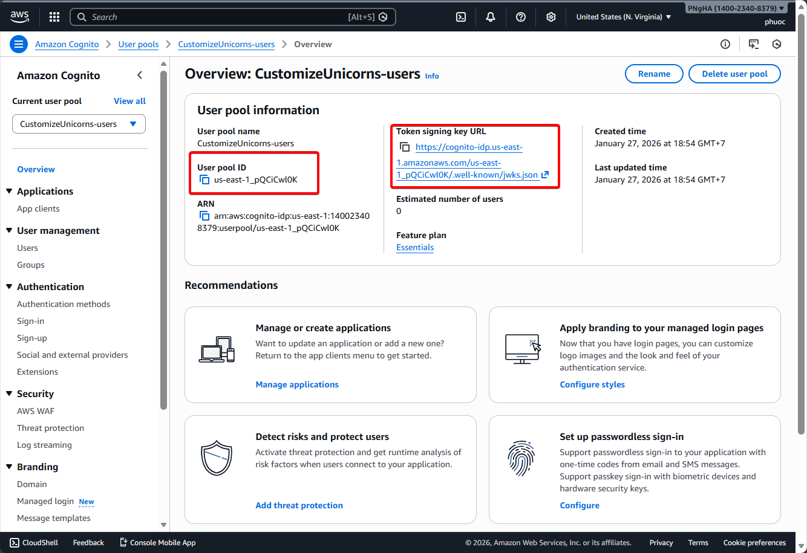

17.  Click on the **App integration** tab

18.  Scroll down to the **App clients** section

19.  Copy the **Client ID** of the **avp-admin-client**

20.  Save the Client ID to your notes file

  

### Part 3: Create Users in Cognito

21. Click on the **Users** tab
22. Click the **Create user** button

  

23.  Enter a username (e.g., username)

24.  Enter a password that meets the password requirements (e.g., Username*)

25.  Click **Create user**

  

26.  User is created with "Force change password" status


27.  Run the following command to set a permanent password:

  ```bash
  aws cognito-idp admin-set-user-password --user-pool-id us-east-1_pQCiCwl0K --username username --password "Password123!" --permanent
  ```
  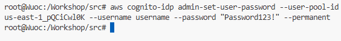
28.  Click on the newly created user to open the user detail page

29.  Scroll down to the **Group memberships** section

30.  Click **Add user to a group**

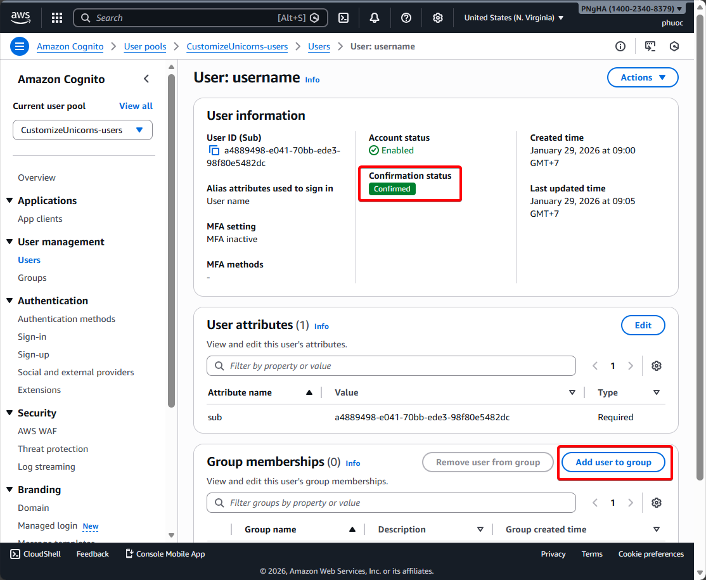

31.  Select the **admin-users** group

32.  Click **Add**

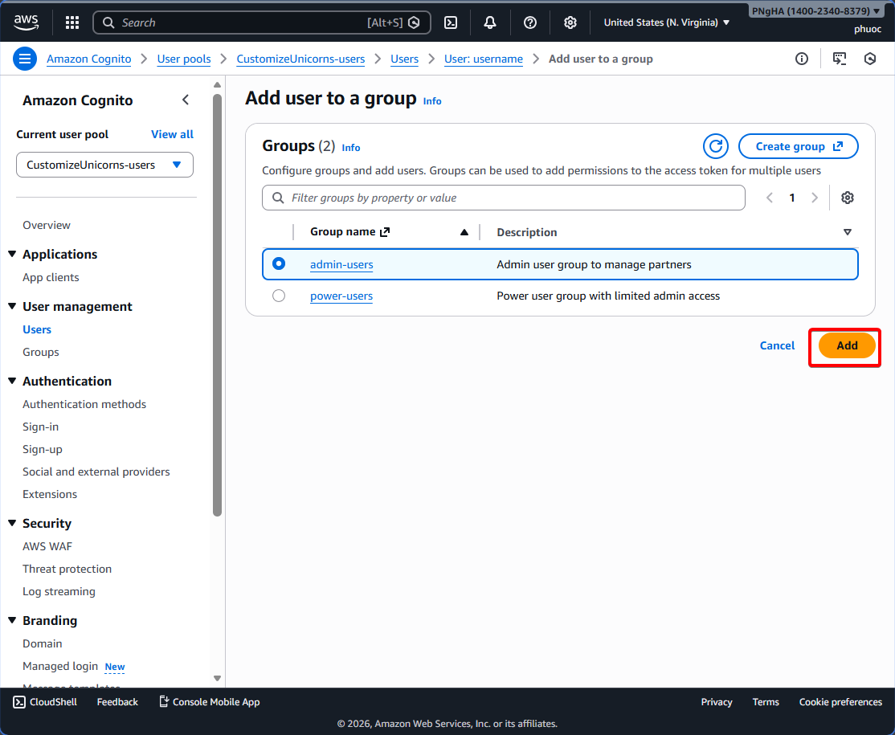

### Part 4: Create Power User

33. Repeat steps 22-25 to create another user (e.g., username2)

  

34. Set a permanent password for the second user:

  ```bash
  aws cognito-idp admin-set-user-password --user-pool-id us-east-1_pQCiCwl0K --username username2 --password "Password123!" --permanent
  ```

  

35.  Add the second user to the **power-users** group

  
  

36.  Verify you have created:
  - One admin user (username) in admin-users group

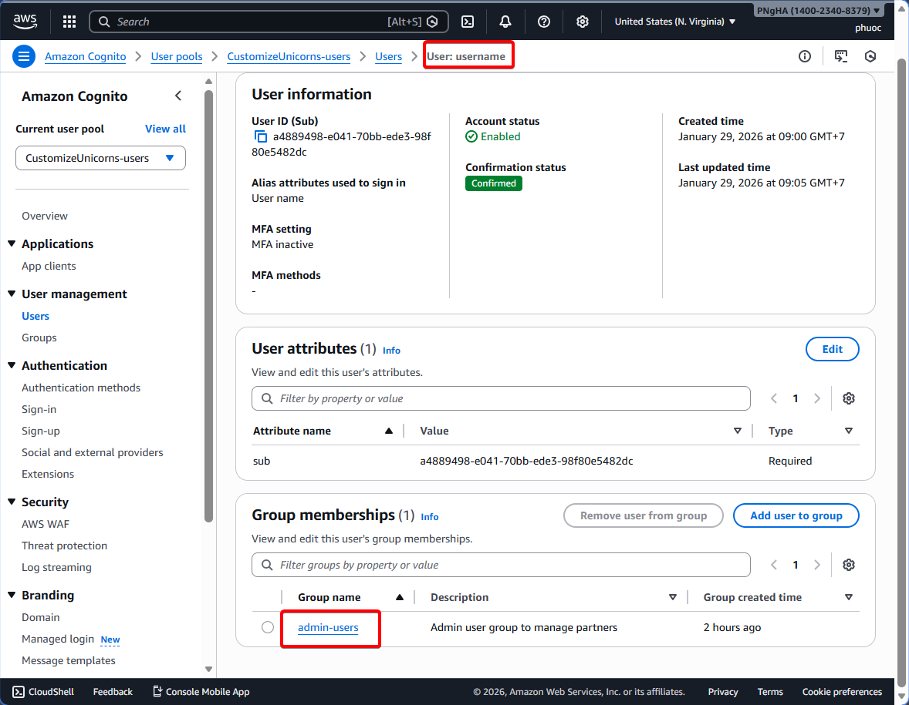

  - One power user (username2) in power-users group

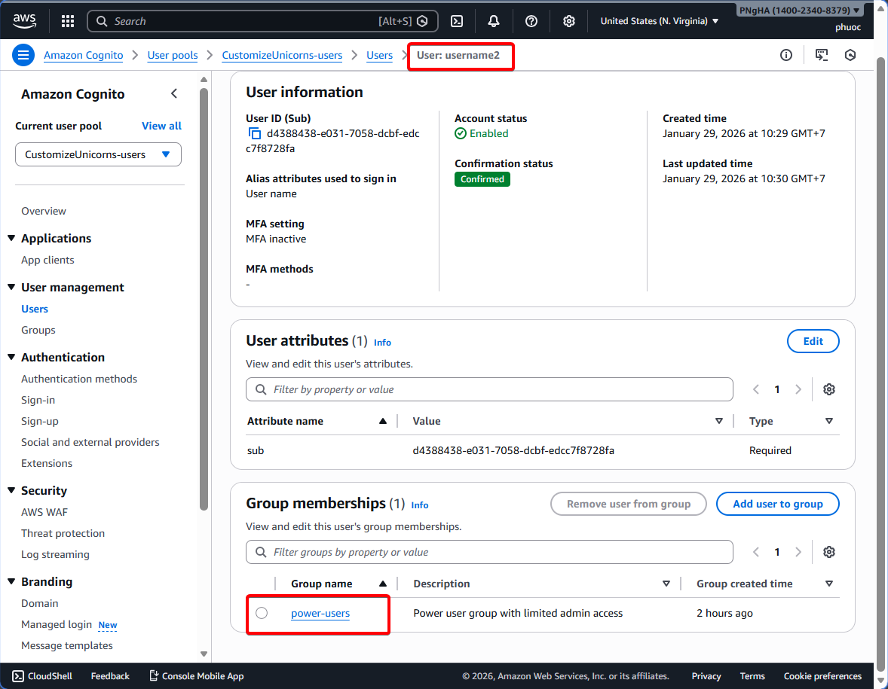

---

## Module 3B: Admin Service Authorization using Amazon Verified Permission

To get started, we need to create an Amazon Verified Permissions policy store. A policy store is a container for policies and policy templates. We recommend creating one policy store per application, or one policy store per tenant for multi-tenant applications.

We'll use Amazon Verified Permissions Quick Start to quickly provision Policy Store based on the Partner Admin API resources and Cognito Userpool Groups. We'll then attach the AVP provisioned Authorizer to the Partner Admin API to enforce the authorization decision.

### Create a Policy Store

1. Log into the AWS Console and open [Amazon Verified Permissions Console](https://console.aws.amazon.com/verifiedpermissions/home)

2. If you haven't created any policy stores in this AWS region yet, click **Create policy store** in the top right

  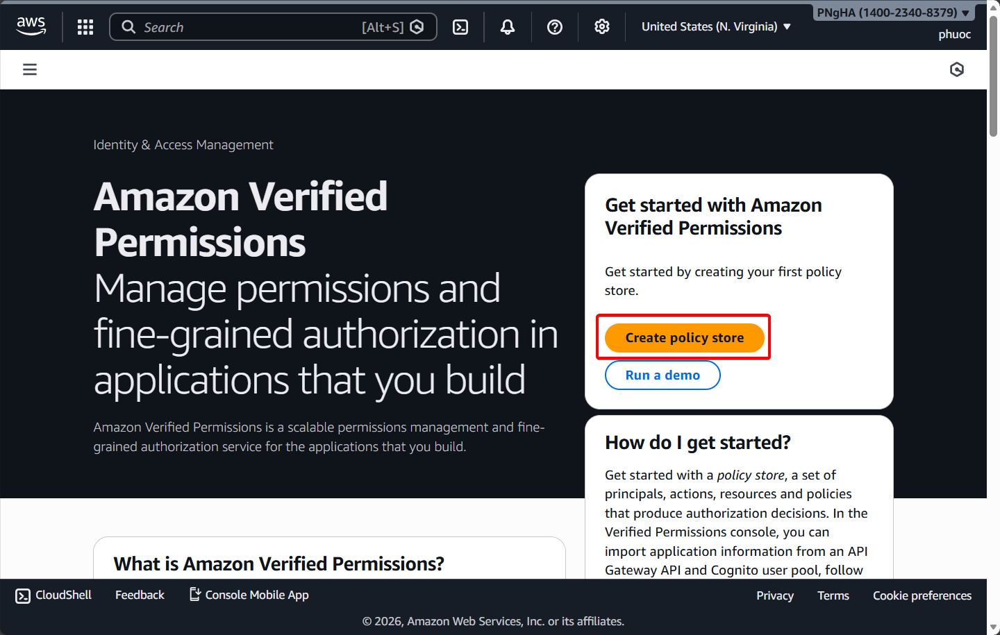

3. Under **Specify policy store details**, choose **Set up with API Gateway and an identity provider**, and click **Next**

  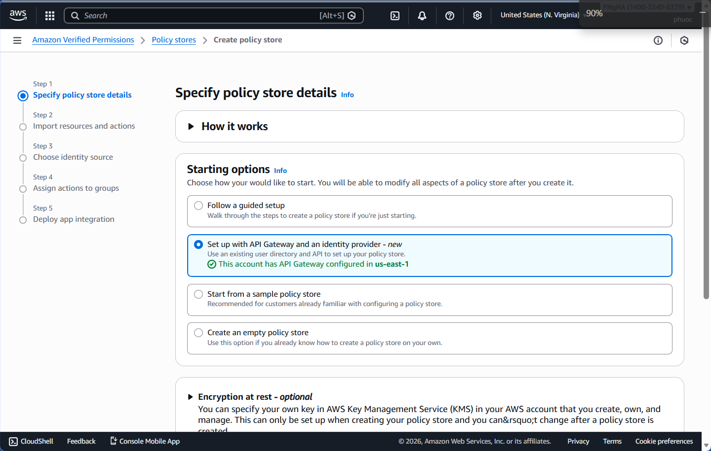

4. On the **Import resources and actions** page:
  - **API**: Select `UnicornPartnerAPI-AVP-Module`
  - **Deployment stage**: Select `dev`
  - Click **Next**

  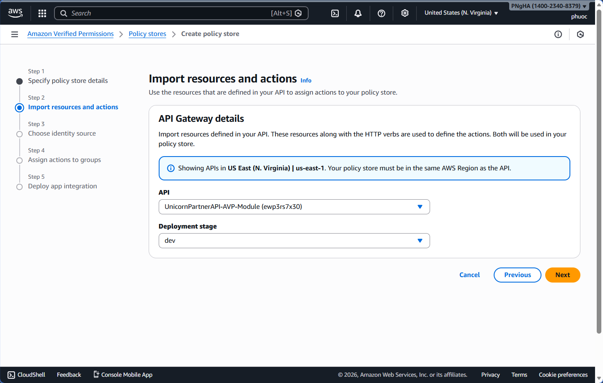

5. On the **Choose identity source** page:
  - Choose `Amazon Cognito` for the OpenID Connect provider type
  - Select `CustomizeUnicorn-users` for Amazon Cognito user Pools
  - Click **Next**

  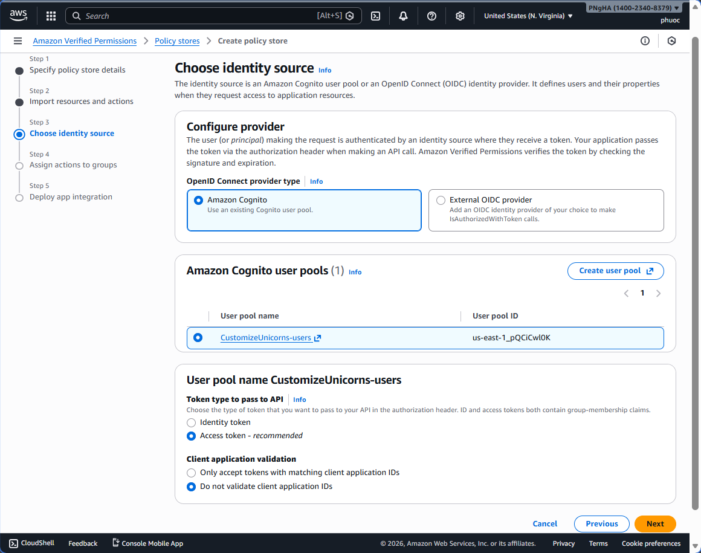

6. On the **Assign actions to groups** page:
  - AVP already imported two groups (`admin-users` and `power-users`) from the Cognito user pool
  - Select `admin-users` group is allowed to perform actions (post /partners) on partners resources
  - Remove the group `power-users`, so users in this group are not allowed to complete any actions
  - Click **Next**

  

7. Review **Deploy app integration** and click **Create policy store**

  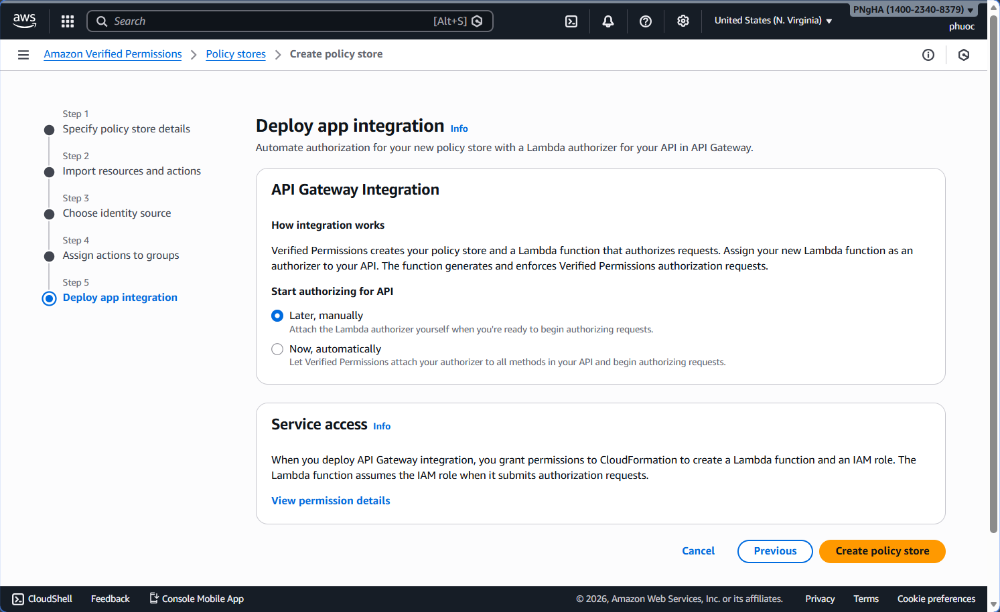

7. This will trigger CloudFormation stack deployment. Wait for the **Deploy CloudFormation** Status to change to **Success**. This should complete in a few minutes.

8. You can also check the status from the [CloudFormation Console](https://console.aws.amazon.com/cloudformation/home)

  
  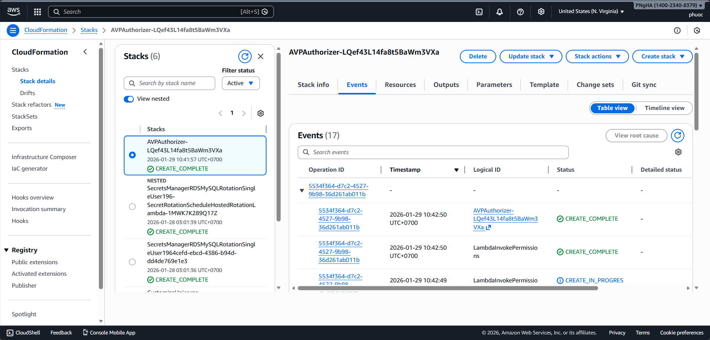

---

## Module 3C: Attach AVP Authorizer to Partner Admin API

Now that our AVP Policy store is deployed, let's attach it to our Partner Admin API Gateway Endpoint Resources.

### Attach AVP Custom Authorizer to the Partner Admin Service API

We'll attach the Custom Authorizer that AVP deployed in the previous section to our Partner Admin Service API from the console. This Custom Authorizer uses the AVP Policy Store we created earlier to make the authorization decision. If you completed Module 1 and attached a Custom Lambda Authorizer there, replace that with the AVP created custom Lambda Authorizer here.

1. Open the [API Gateway Console](https://console.aws.amazon.com/apigateway/home)

2. Click on **UnicornPartnerAPI-AVP-Module** API

3. Click on **/partners** resource and **POST** action

4. Under the **Method request** tab, click **Edit**

  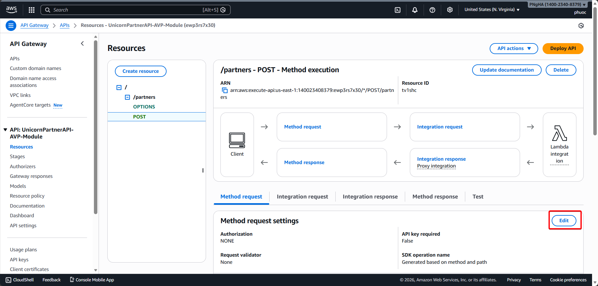

5. Under the **Edit method request** page, select the Authorizer that starts with `AVPAuthorizer-` for **Authorization**

6. Click **Save**

  

7. Click **Deploy API** to deploy it to the `dev` stage

  
  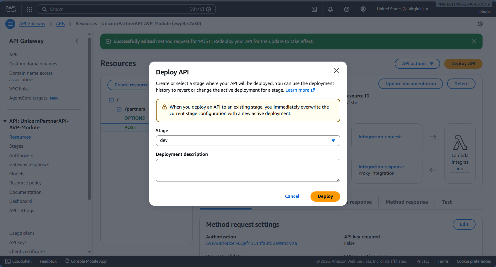

Your Partner Admin API is now protected using Amazon Verified Permissions. In the next section, we'll test the authorization.

---

## Module 3D: Testing

Now that we've configured Amazon Verified Permissions and attached the authorizer to our Partner Admin API, let's test the authorization to ensure it works correctly.

### Test 1: Register a Partner as Admin User

1. Using the API Client tool, we're going to make a POST call to the token signing endpoint using the URL you copied earlier in this module

2. Navigate to the API Client tool section **Module 3D: Testing**

3. Populate the following fields:
  - The **token signing URL** (ex. `https://cognito-idp.us-east-1.amazonaws.com/{YOUR USER POOL ID}/.well-known/jwks.json`)
  - The **username** of the first user you created and added to the admin group (ex. username)
  - The **password** for the user
  - The **Client ID** we copied from earlier in this module

4. You will notice the body is dynamically created using your inputs. This is the format your applications would send to the token signing endpoint

5. Click **Get Access Token**

  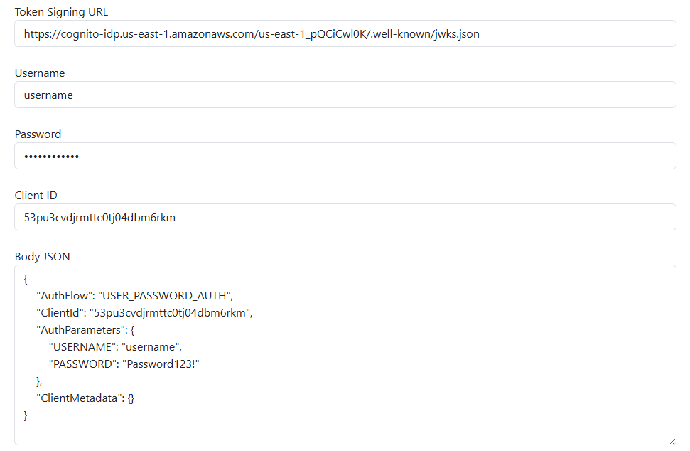
  

6. Copy and paste the new AVP API Gateway URL you copied earlier in this module into the textbox just below the access token Response

7. Include a `/partners` path at the end of your API Gateway endpoint

8. In the **Body JSON** section, add a new partner by copying and pasting the JSON below:

  ```json
  { 
    "name":"Grape Company"
  }
  ```

9. Click **Send**

10. Since the user you added to the **admin-users** Cognito group has permissions through AVP to access the new `/partners` API path, they are authorized to create new partners

11. You should receive a response back with a new Client ID and Client Secret:

  

### Test 2: Test with Power User (Should Fail)

12. Repeat the steps above to test with the user you added to the **power-users** Cognito group (ex. username2)
  
  
13. Use a new partner by copying the JSON below into the **Body JSON** section:

  ```json
  { 
    "name":"Raspberry Company"
  }
  ```

14. Click **Send**

15. This time, the call to the `/partners` API path should fail with an **explicit deny** because your user is not authorized to call the `/partners` API path

  

---
