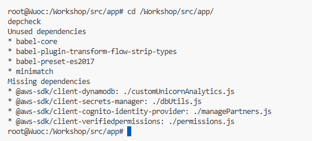
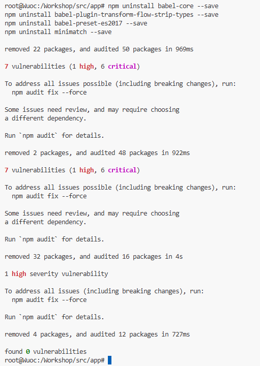

# Module 6: Dependency Vulnerability

## Overview

When building modern applications, it is common to use different libraries, modules and various dependencies. Even if you include a simple dependency, you could end up with tens or even hundreds of sub-dependencies.

### The Dependency Problem

Just take a look at this [npm dependency graph visualization](https://npm.anvaka.com/#/view/2d/http-request). A simple module like `request` could end up with 60+ sub-dependencies!

If you never thought about the impact a single vulnerable dependency can have, take a look at the famous [left-pad incident of 2016](https://www.theregister.co.uk/2016/03/23/npm_left_pad_chaos/), which showed how removing a single small dependency broke thousands of projects.

---

## Find Vulnerabilities with npm audit

The tooling for dependency vulnerability checking varies for different programming languages. With Node.js, vulnerability checking is now a feature shipped with the `npm` package manager itself after npm acquired NSP (Node Security Platform).

Running `npm audit` command will produce a report of security vulnerabilities, and if available, commands to apply patches to resolve vulnerabilities. In fact, `npm audit` automatically runs when you install a package with `npm install`.

### Step 1: Navigate to Node Application Directory

1. In the VS Code Server environment, go to the node application directory where `package-lock.json` is located:

  ```bash
  cd /Workshop/src/app
  ```

### Step 2: Run Vulnerability Audit

2. Run the vulnerability audit:

  ```bash
  npm audit
  ```

3. You should see output similar to this:

  

### Interpret the Results

From the output, you can see that `minimatch:2.0.10` dependency has a known vulnerability. Reading the security advisory in the report gives you more details on how it can be exploited.

**Before attempting to patch:** We should ask first - is the application even using minimatch? This library compares expressions against regular expressions to find matches.

In fact, our application is **not even using the library**, so we should remove it instead of patching.

> **Note:** This can often happen in software projects when a library was pulled into the codebase to experiment with something, but later the code evolved and that dependency is no longer required.

---

## Remove Unused Dependencies Using Static Analysis

But how do we know for sure which dependencies we are using and which ones are not? We'll use the `depcheck` tool to find out.

### Step 1: Install depcheck

1. Run the following command to install [depcheck](https://www.npmjs.com/package/depcheck?activeTab=readme):

  ```bash
  sudo npm install -g depcheck
  ```

### Step 2: Analyze Dependencies

2. Run the tool with the following commands:

  ```bash
  cd /Workshop/src/app/
  depcheck
  ```

### Step 3: Review Results

3. The result should be something like this:

  

  > **Note:** Missing dependencies like `@aws-sdk` are already installed in the [Lambda runtime environment](https://docs.aws.amazon.com/lambda/latest/dg/current-supported-versions.html) and don't need to be in your package.json.

---

## Remove Unused Dependencies

Therefore, we should remove the unused dependencies. Run the following commands:

```bash
npm uninstall babel-core --save
npm uninstall babel-plugin-transform-flow-strip-types --save
npm uninstall babel-preset-es2017 --save
npm uninstall minimatch --save
```


### Verify Cleanup

To be sure we removed unused dependencies, run `depcheck` again:

```bash
depcheck
```


The output should now show no unused dependencies.

**Success!** Now your code is free of vulnerabilities from the dependency perspective!

> **CI/CD Integration:** These steps should be part of your CI/CD pipeline and implemented to run on every deployment.

---