# Module 9: Usage Plans

## Overview
You can leverage Usage Plans with Amazon API Gateway to set limits on request rate for consumers of your API.

Usage Plans protect your API from being abused by:
- Misbehaving clients
- Buggy applications
- Malicious actors attempting denial-of-service (DoS) attack


---

## Module 9A: Create Plan

In this section, we'll create an API Gateway usage plan with rate limits and associate it with the CustomizeUnicorns API.

### Step 1: Create an API Gateway Usage Plan

1. Go to your AWS Console and navigate to **API Gateway**

2. Click on **CustomizeUnicorns** API

3. Click on **Usage Plans** in the left side menu

4. Click **Create**
   

5. Fill in the details for the usage plan:
  - **Name**: `Basic`
  - **Description**: `Basic usage plan for Unicorn customization partners`
  - **Enable Throttling**: Check this box
  - **Rate**: `1` request per second
  - **Burst**: `1`
  - **Enable Quota**: Check this box
  - **Requests**: `100` requests `Per month`

  

6. Click **Create usage plan**

7. You should see the newly created Usage plan in the list:

  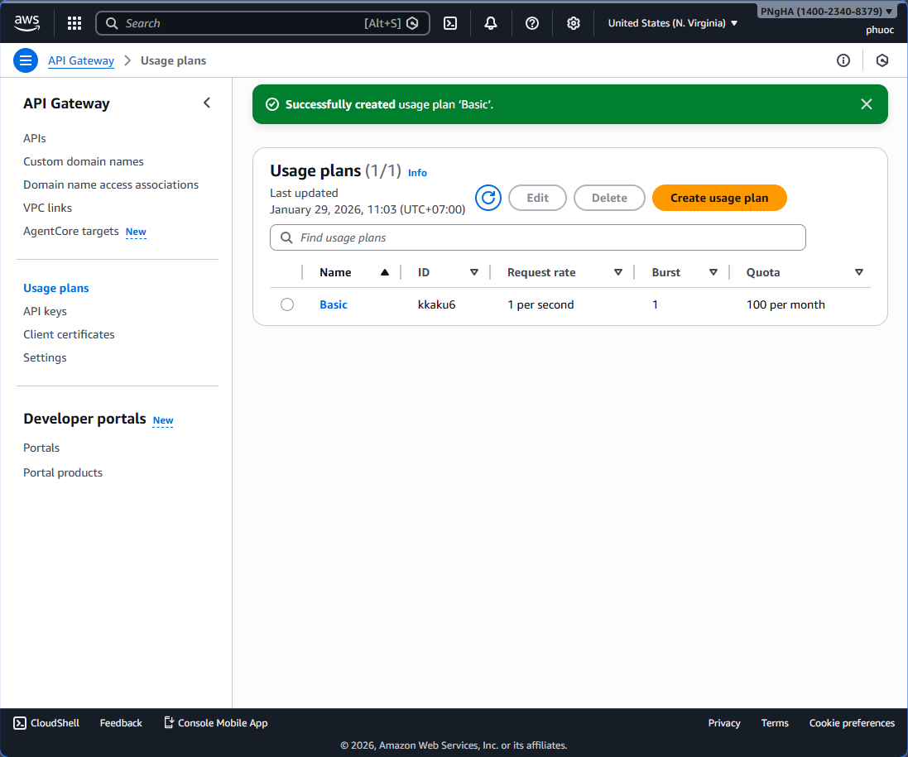

### Step 2: Associate the CustomizeUnicorns API with the Usage Plan

8. Click on the **Basic** Usage plan from the list

9. This should open the Usage plan details screen. Click **Add API Stage** button

  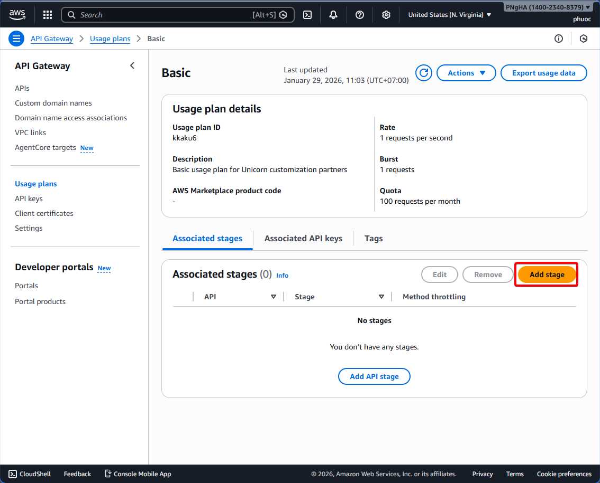

10. Select **CustomizeUnicorns** API from the dropdown

11. Pick **dev** stage

12. Click **Add to usage plan** button

  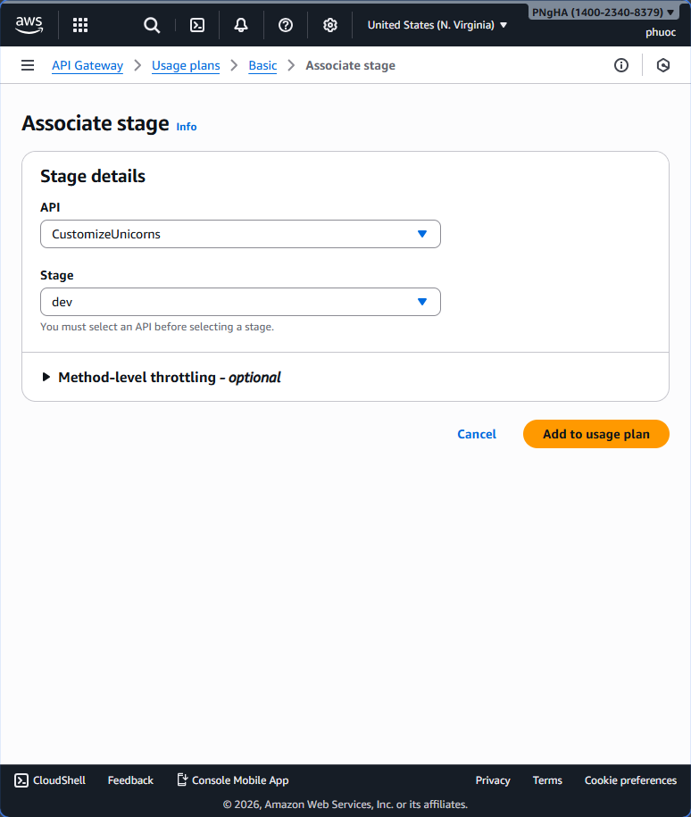
  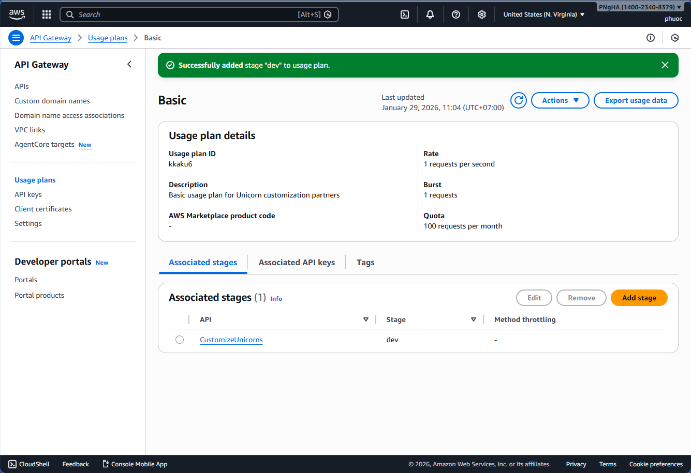

### Step 3: Create and Add API Key

13. On the Basic Usage plan detail page, click on the **Associated API keys** tab

14. Click the **Add API key** button to create an API key for the partner company

  

**Option A: If you have NOT done Module 1:**

- For **Name**, pick any name (e.g., `cherry company`)
- For **API key**, select **Generate a key automatically**
- Click **Add API key**


**Option B: If you HAVE done Module 1:**

- For **Type**, Select **Create and add new key**
- For **Name**, use the company name you created in Module 1: Auth
- For **API key**, select **Provide a custom key** so we can import the value
- In the input text box, use the same value as the ClientID of the company (if you forgot it, you can retrieve it from Cognito console > User Pool > CustomizeUnicorns-users > App Integration Tab > App client list section)
- Click **Add API key**

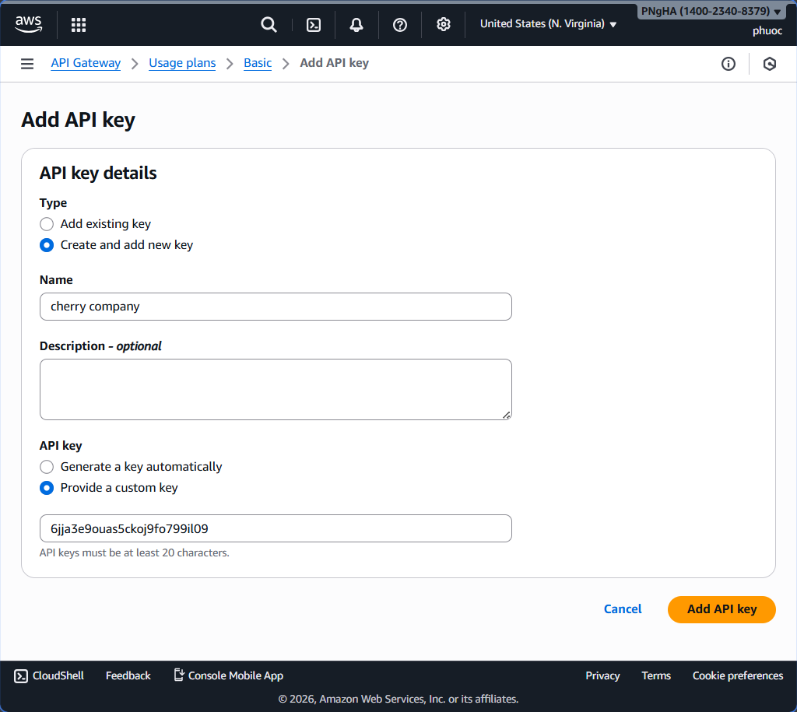

15.  You should see the API key associated with the Basic Usage plan:


---

## Module 9B: Update Gateway

In this section, we'll modify the API Gateway to enforce API key requirements on the CustomizeUnicorns API.

### Update API Gateway to Enforce API Keys

Now we need to modify our API Gateway so requests must have an API key present.

**If you have done Module 1:**

Update your CloudFormation template to require API keys. In your `src/template.yaml` file, update the relevant resource to include API key requirement in the method request settings.
1. In the API swagger definition in template.yaml, add the below lines to add an additional type of AWS security:
``` yaml
         ApiKey:
          type: apiKey
          name: x-api-key
          in: header
```

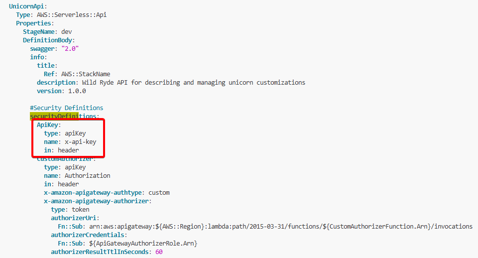
2. for the APIs in the Swagger template for customizing unicorns and listing customization options (leave out the /partners APIs for now), add the below
``` yaml

       #API Key
                - ApiKey: []
```
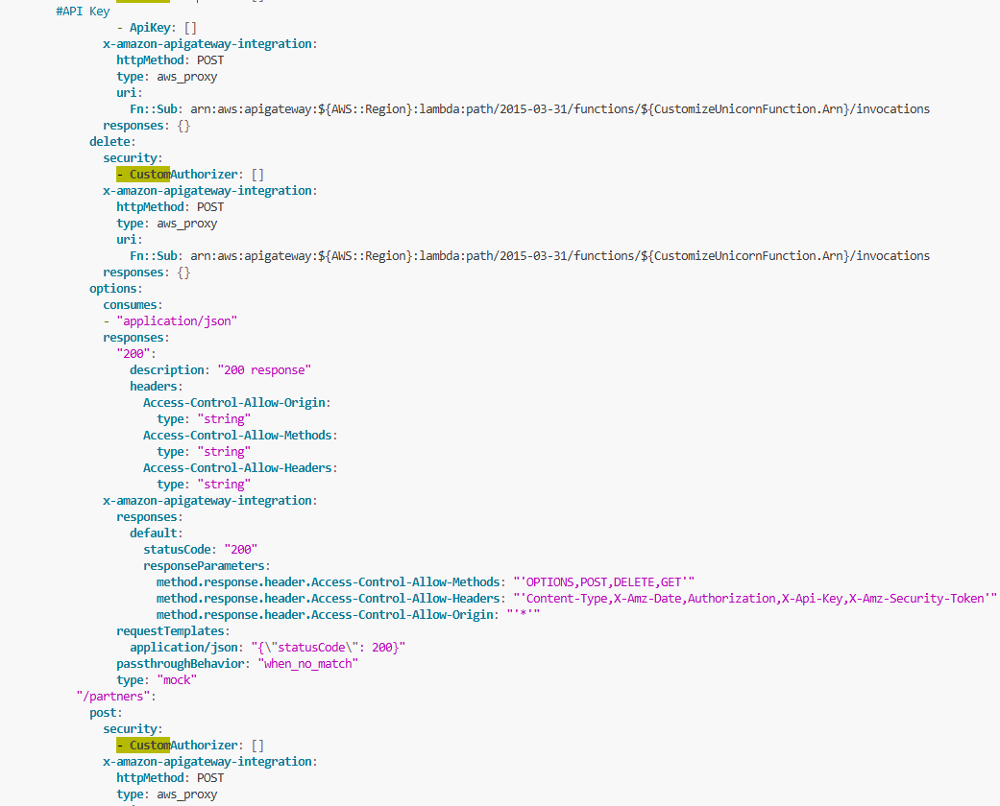

**If you have not done Module 1:**

Use the AWS Console to manually enable API key requirement on the API methods.

### Deploy the Changes

1. Validate the template in the terminal:

  ```bash
  sam validate -t template.yaml --region $REGION
  ```

2. Deploy the updates:

  ```bash
  aws cloudformation package --output-template-file packaged.yaml --template-file template.yaml --s3-bucket $DeploymentS3Bucket --s3-prefix securityworkshop --region $REGION && aws cloudformation deploy --template-file packaged.yaml --stack-name CustomizeUnicorns --region $REGION --parameter-overrides InitResourceStack=Secure-Serverless --capabilities CAPABILITY_IAM
  ```
  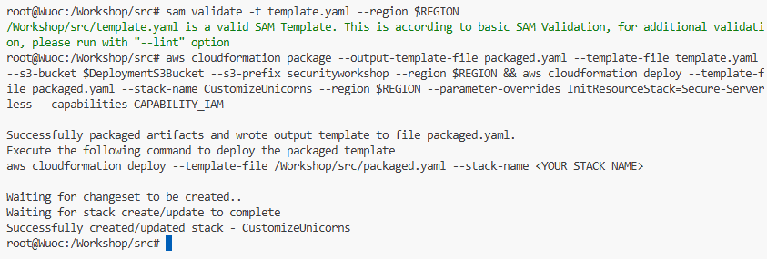
   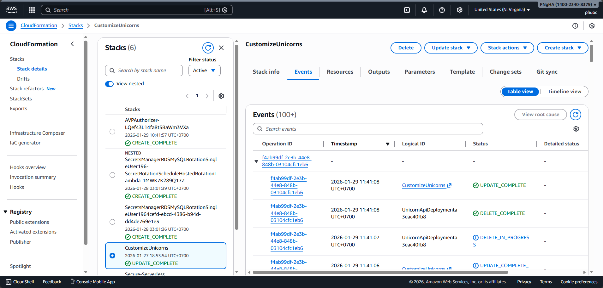
3. Once the deployment completes, verify the changes:

  - Go to the [API Gateway Console](https://console.aws.amazon.com/apigateway/home)
  - Navigate to **CustomizeUnicorns** API
  - Click on **Resources**
  - Pick a method
  - Click on the **Method request** tab
  - You should now see the **API key required** field set to `True`

  

---

## Module 9C: Test Request

In this section, we'll test that our API now requires API keys and verify that requests with valid keys are accepted.

### Test Request with API Keys

1. Go back to the **API Client** tool

2. Now that the API is enforcing API keys, requests will fail if you don't include the API key header

3. Try sending a request using the API Client like you did in Module 0

4. You should see the request fail with a **403 Forbidden** status code and a `{"message": "Forbidden"}` response

  > **Note:** If the response is **401 Unauthorized** and you have completed Module 1, most likely your access token is expired. Use the API Client to request a new access token and try again.

   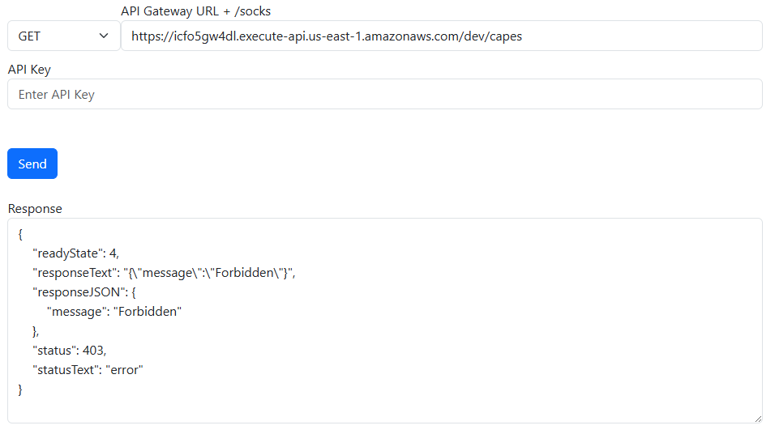
### Add API Key to Request Header

5. You can add the API key request header by going to the **Header** tab

6. Add the following header:
  - **Header key**: `x-api-key`
  - **Header value**: The API Key that we added to the usage plan in Module 9A:
    - **If you have done Module 1**: This should be the same as the Cognito app Client ID
    - **If you have not done Module 1**: You can copy the auto-generated API key value by:
      - Going to the **API keys** tab on the left navigation in the API Gateway console
      - Click on the small "copy" icon next to the API key value under the API key column in the API keys table

  

7. Send the request again

8. You should now see the request go through successfully with the API key included:

  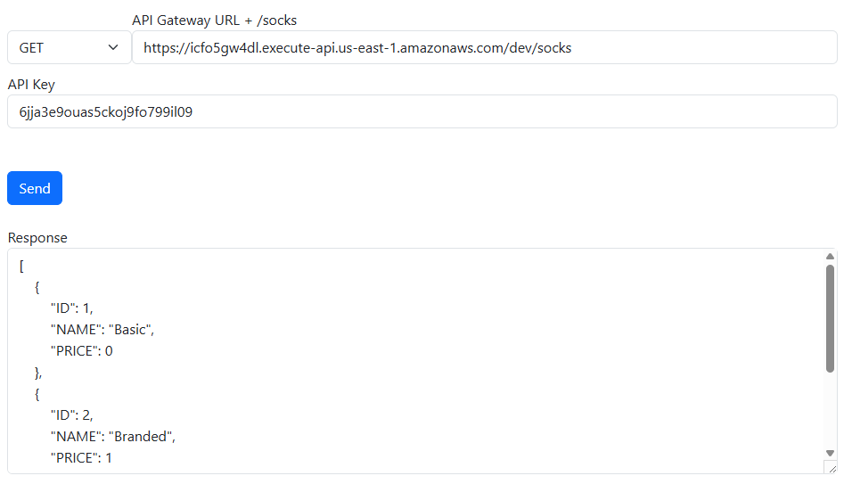

---

## Module 9D: Use Authorizer

> **Optional:** This module assumes you have completed Module 1

If you have already completed Module 1, you can make the API consumer's life easier by having API Gateway extract the API Key from the Lambda authorizer instead of forcing them to add a separate `x-api-key` header to their requests.

Read more about the two sources of API keys supported by API Gateway in the [AWS Documentation](https://docs.aws.amazon.com/apigateway/latest/developerguide/api-gateway-api-key-source.html).

### Configure API Key Source from Authorizer

1. In the API swagger definition in `src/template.yaml`, add the following line at the same level as the `securityDefinitions` or `paths` field:

  ```yaml
  #Authorizer
  x-amazon-apigateway-api-key-source: AUTHORIZER
  ```

  

1. We also need to make the Lambda authorizer return the API Key as part of the auth response

2. Open the file `authorizer/index.js`

3. Find the following lines in the code and uncomment the second line:

  ```javascript
  // Uncomment here to pass on the client ID as the api key in the auth response
  // authResponse.usageIdentifierKey = payload["client_id"];
  ```

  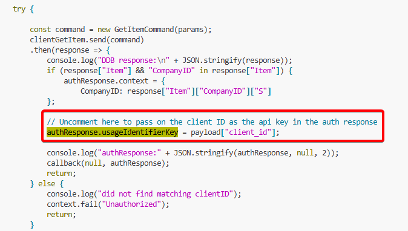

### Deploy the Changes

5. Validate the SAM template:

  ```bash
  sam validate -t template.yaml --region $REGION
  ```

6. Deploy the updates:

  ```bash
  aws cloudformation package --output-template-file packaged.yaml --template-file template.yaml --s3-bucket $DeploymentS3Bucket --s3-prefix securityworkshop --region $REGION && aws cloudformation deploy --template-file packaged.yaml --stack-name CustomizeUnicorns --region $REGION --parameter-overrides InitResourceStack=Secure-Serverless --capabilities CAPABILITY_IAM
  ```
   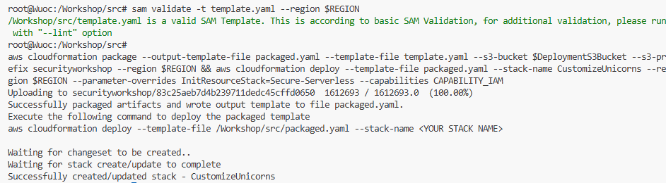
  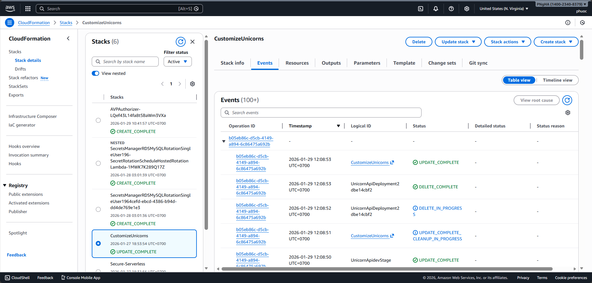

### Test the Configuration

7. Once the deployment finishes, test making API requests again with the API Client

8. You should now be able to **remove the `x-api-key` request header** and the request should still succeed

> The API Gateway now automatically extracts the API key from the authorizer's response, simplifying the API consumer experience.


---

## Module 9E: Test Throttling

> **Optional:** This module assumes you have completed Module 1 and Module 9D!

> **Note:** If you have not completed Module 1 and Module 9D, you will need to add the `x-api-key` header to each API request in the collection first!

> **Important:** It may take 5-10 minutes for the usage to display and start rejecting requests.

You can use the API Client to send multiple API requests in sequence to test the throttling behavior of your usage plan.

### Test Throttling with the API Client

1. Navigate to the **API Client** and click on section **Module 9E: Test Throttling**

2. Retrieve a fresh partner token

3. Enter your API key in the **API Key** textbox (if you didn't complete Module 9D)

4. Click the **Send 20 times** button

5. You should see a **429 Too Many Requests** error response after exceeding the rate limit (1 request per second with burst of 1)

  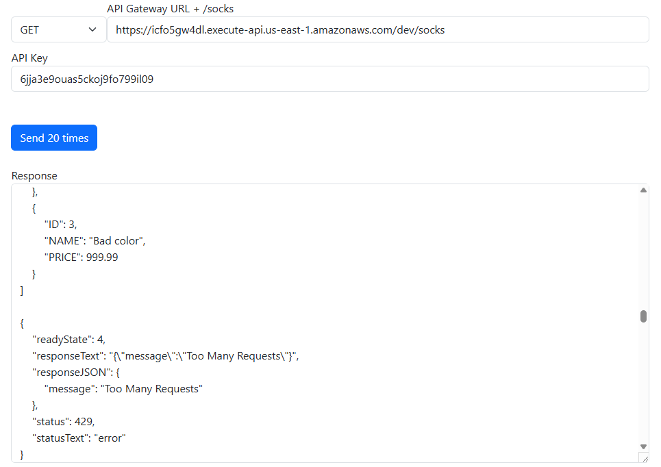