# Module 12: X-Ray

## Overview
> "Security Logging & Monitoring Failures" is one of the Top 10 Application Security Risks ranked by OWASP in 2021.

AWS X-Ray gives you visibility into the data flow of your microservices architecture and a map of how your application's underlying components are connected. It's a great tool to troubleshoot performance and debug errors. However, given the ephemeral nature of the infrastructure in a serverless application, this visibility into your application is also critical for the purpose of security:

- It helps you understand the "norm" of the data flow, interdependencies, and performance characteristics of your distributed serverless components. Knowing that is a prerequisite of recognizing when things are not normal.
- During a security incident or post analysis, X-Ray can give you insights into what your code is doing at runtime, what downstream dependency it's making calls to and where the code is spending its time

## Module Sections

## Module 12A: Enable X-Ray

### Enable X-Ray in SAM Template

X-Ray tracing for Lambda functions is enabled in the SAM template using the `Tracing: Active` configuration.

**Open the SAM Template:**
1. In VS Code Server, navigate to your project
2. Open `template.yaml` file
3. Locate the `Globals` section at the top

**Current Configuration:**
```yaml
Globals:
 Function:
  Timeout: 30
  # ... other settings
```

**Add X-Ray Tracing:**
```yaml
Globals:
 Function:
  Timeout: 30
  Tracing: Active
  # ... other settings
```

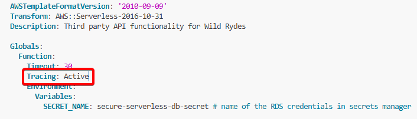

## Module 12B: Capture Requests

### Overview

When applications make calls to AWS services (Secrets Manager, DynamoDB, S3, etc.), the X-Ray SDK can track these calls downstream and record request timing, status, and other details about AWS service calls.

To enable this, instrument all AWS SDK clients by wrapping your `@aws-sdk` clients in a call to `AWSXRay.captureAWSv3Client`.

> **Note:** If you haven't completed Module 1 AND Module 2, you can skip to Module 12C.

### Capturing AWS SDK Requests in Lambda Authorizer

The Lambda authorizer added in Module 1 uses the AWS SDK to look up values from a DynamoDB table. Instrument the AWS SDK with X-Ray:

> **Note:** If you haven't done Module 1, skip to the next section "Capturing AWS SDK Requests in Backend Lambda Functions"

**Step 1: Install X-Ray SDK**

In VS Code Server terminal, install the X-Ray SDK in the `authorizer/` folder:

```bash
cd /Workshop/src/authorizer
npm install aws-xray-sdk-core --save
```

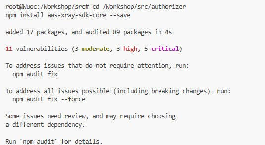

**Step 2: Import X-Ray SDK**

In `authorizer/index.js`, add this line at the top of the file:

```javascript
import AWSXRay from "aws-xray-sdk-core";
```


**Step 3: Wrap DynamoDB Client**

Find this code in `authorizer/index.js`:

```javascript
const clientGetItem = new DynamoDBClient({});
```

Replace it with:

```javascript
const clientGetItem = AWSXRay.captureAWSv3Client(new DynamoDBClient({}));
```

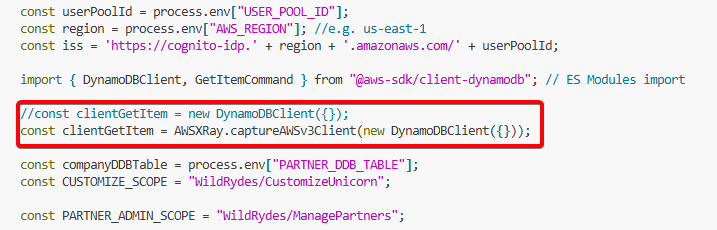

### Capturing AWS SDK Requests in Backend Lambda Functions

**If you haven't gone through Module 4: Secrets**

If you skipped Module 4 and your backend Lambda functions don't use AWS SDK clients, you can skip this section and proceed to Module 12C.

**If you have gone through Module 4: Secrets**

Your backend Lambda functions use the AWS SDK to retrieve secrets from Secrets Manager. Follow the same pattern to instrument these calls:

**Step 1: Install X-Ray SDK in Backend Functions**

Install the XRay SDK in the app/ folder by running in a terminal

```bash
cd /Workshop/src/app
npm install aws-xray-sdk-core --save
```

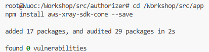

**Step 2: Import X-Ray SDK**

In app/dbUtils.js, add the line below to the top of the file:

```javascript
import AWSXRay from "aws-xray-sdk-core";
```


**Step 3: Wrap Secrets Manager Client**

Find code that instantiates Secrets Manager client:

```javascript
const client = new SecretsManagerClient({});
```

Replace with:

```javascript
const client = AWSXRay.captureAWSv3Client(new SecretsManagerClient({}));
```


## Module 12C: Deploy and Test

Now that you've enabled X-Ray tracing and instrumented your code, deploy the updates and verify that traces are being captured.

**Step 1: Validate SAM Template**

In the terminal, validate your SAM template to ensure there are no syntax errors:

```bash
cd /Workshop/src/
sam validate -t template.yaml --region $REGION
```

**Expected Output:**
```
/Workshop/src/template.yaml is a valid SAM Template
```

**Step 2: Deploy the Updates**

Package and deploy your updated application:

```bash
aws cloudformation package --output-template-file packaged.yaml --template-file template.yaml --s3-bucket $DeploymentS3Bucket --s3-prefix securityworkshop --region $REGION && \
aws cloudformation deploy --template-file packaged.yaml --stack-name CustomizeUnicorns --region $REGION --parameter-overrides InitResourceStack=Secure-Serverless --capabilities CAPABILITY_IAM
```

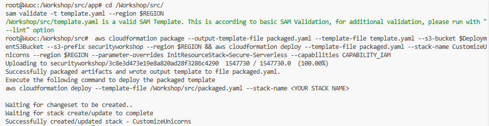
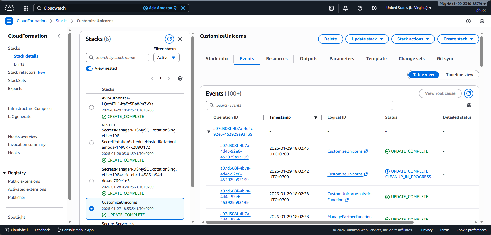

**Step 3: Test Making API Requests**

Once deployment finishes, test your API to generate X-Ray traces:

**Using API Client:**
1. Open your API client (Postman, Insomnia, etc.)
2. Make requests to your API endpoints
3. Use the Authorization header with your access token
4. Make several requests to generate multiple traces


**Step 4: View X-Ray Service Map**

Navigate to the X-Ray console to see your traces:

1. Open [AWS X-Ray Console](https://console.aws.amazon.com/xray/home)
2. Click **Service map** tab on the left navigation
3. Refresh the page
4. You should start seeing Lambda requests getting captured!


> **Note:** The service map you see might look different depending on which modules you've completed.

## Module 12D: Enable API Gateway

### Enable X-Ray on API Gateway

To get complete end-to-end visibility of your serverless application, enable X-Ray tracing on API Gateway. This captures the API Gateway segment of each request trace.

**Step 1: Navigate to API Gateway Console**

1. Go to [AWS API Gateway Console](https://console.aws.amazon.com/apigateway/home)
2. Click on `CustomizeUnicorns` API in the list

**Step 2: Access Stage Settings**

1. Select **Stages** from the left-hand navigation menu
2. Click on the `dev` stage
3. Scroll down to the **Logs and tracing** panel
4. Click the **Edit** button


**Step 3: Enable X-Ray Tracing**

On the Logs and tracing settings page:
1. Check the box for **X-Ray tracing**
2. Click **Save changes**

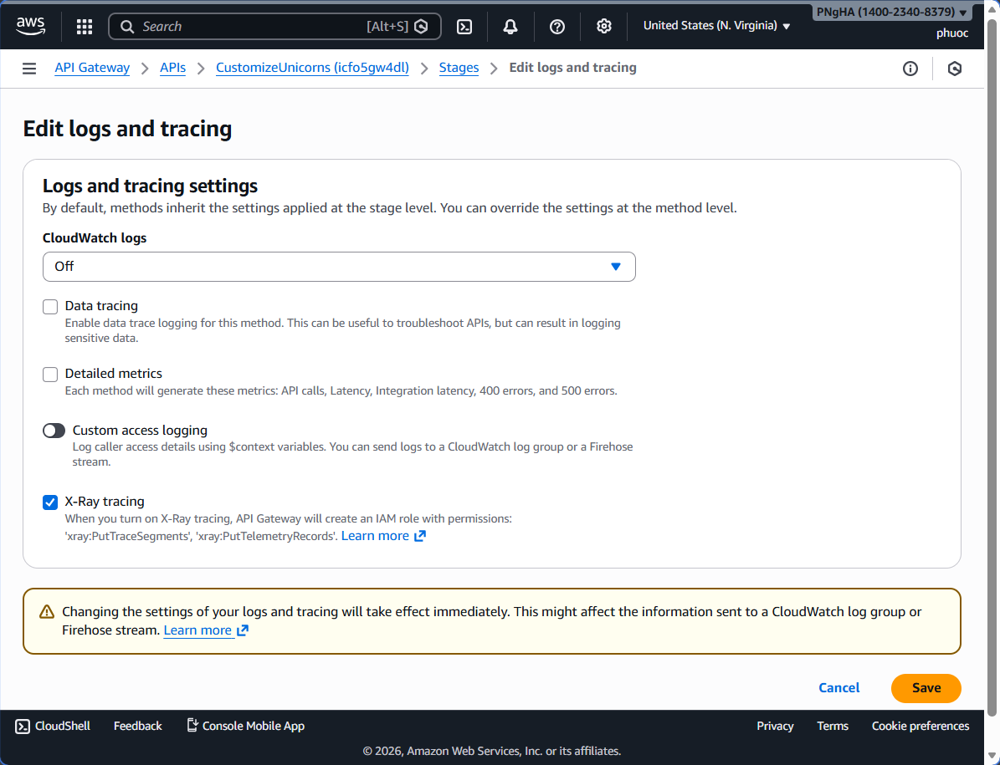


**Step 4: Redeploy the API**

Changes to stage settings require redeployment:

1. Click on the **Resources** tab on the left-hand side
2. Click **Deploy API** button on the top right side of the page

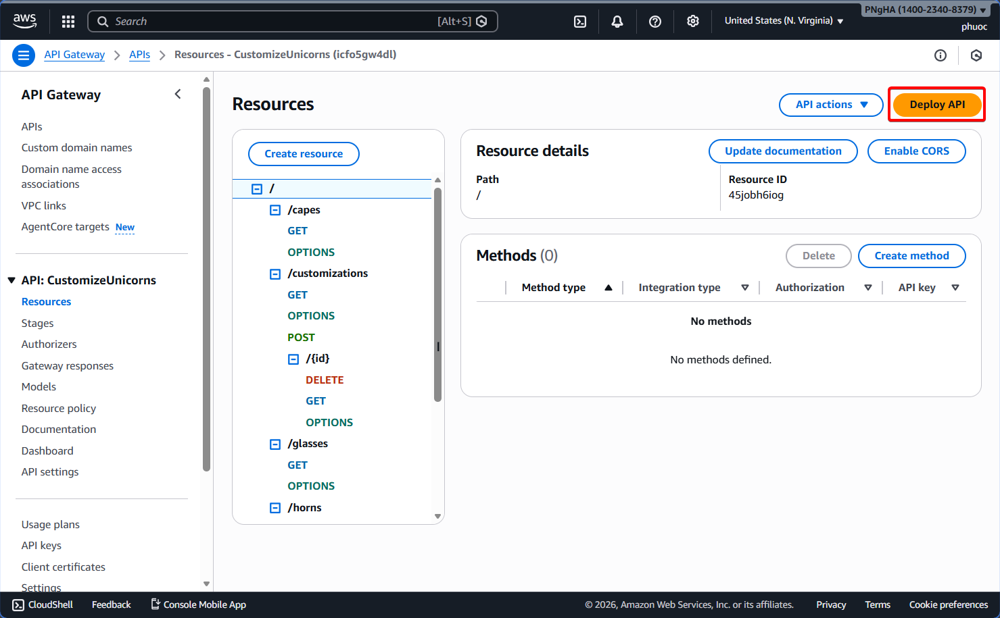

3. In the deployment dialog:
   - Pick the `dev` stage from the dropdown
   - Click **Deploy**


**Step 5: Test Making API Requests**

Generate new traces with API Gateway data:

1. Open your API client
2. Make a few API requests to your endpoints
3. Use proper Authorization headers
4. Wait 1-2 minutes for traces to process

**Step 6: View Updated Service Map**

Navigate to X-Ray console to see the complete trace:

1. Go to [AWS X-Ray Console](https://console.aws.amazon.com/xray/home)
2. Go to the **Service map** tab
3. Refresh the page

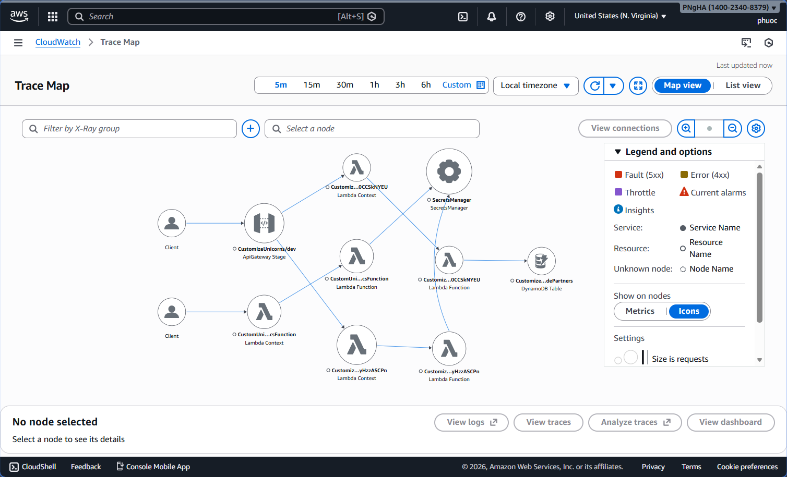

> **Note:** The service map you see might look different depending on if you have done Module 1 & Module 2.

**Step 7: Explore Service Map Components**

Click on various components in the service map:

1. Click on **API Gateway** node
2. Click **View traces** to see list of request traces
3. Review metrics like average latency, request count, error rate

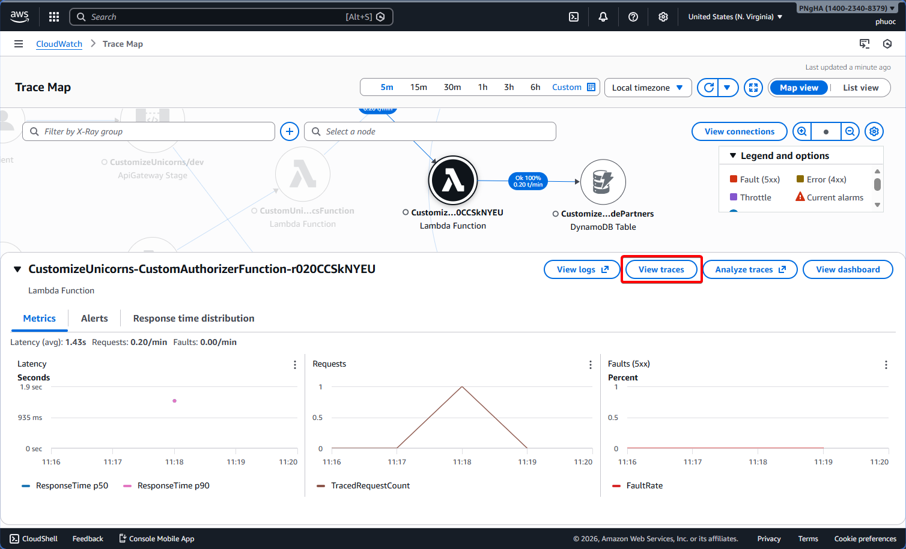

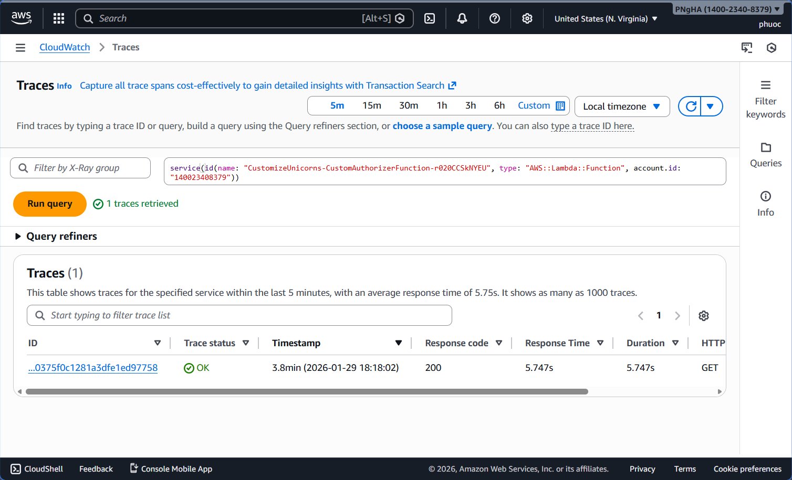

**Step 8: Explore Individual Traces**

Click into individual requests to see detailed timeline:

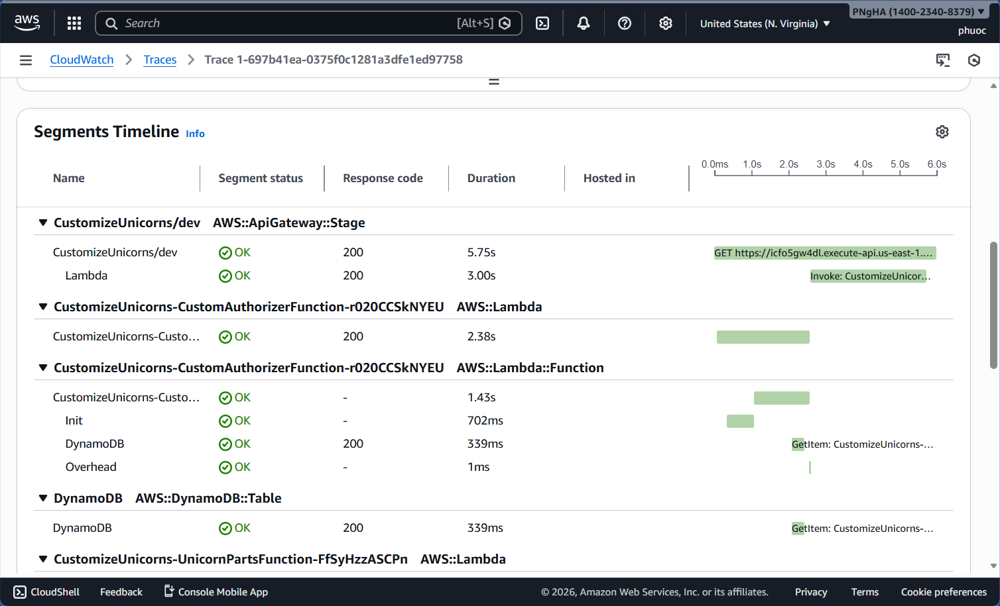

---