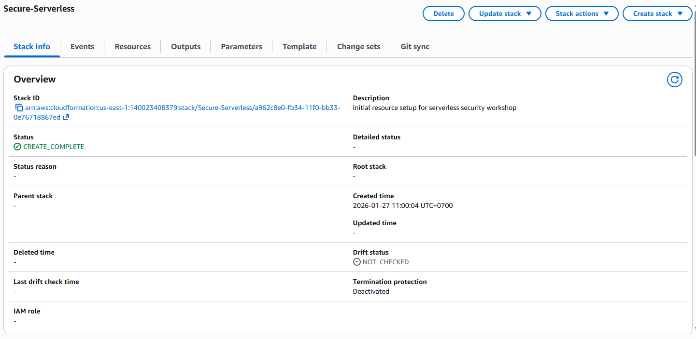
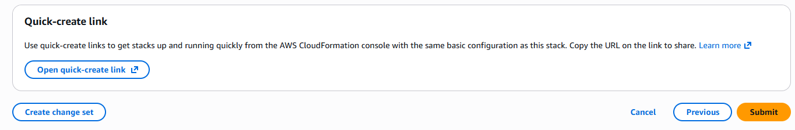
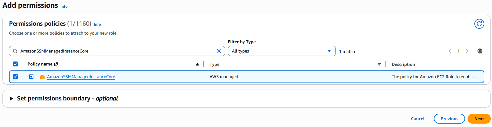
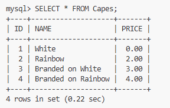

# Module 0: Initial Setup

## Overview
In this setup module, you will deploy a simple serverless application, which you will learn to secure in the following modules. You will create a REST API endpoint so partner companies of Wild Rydes can submit unicorn customizations, such as branded socks and capes, to advertise their company.

## Architecture
Below is a high-level architecture of what you will be deploying:


## Prerequisites

### For AWS Sponsored Events
If you are completing this workshop at an AWS-sponsored event where an AWS account is provided for you, you will be using AWS Workshop Studio. In this case, the prerequisites are already met and you can proceed to the "AWS Event Setup" section below.

### For Non-AWS Events or Your Own Account
You will need:
- **AWS Account**: Full access to create and manage AWS resources
- **Supported Regions**: Choose one region and use it throughout the workshop:
  - **US East (N. Virginia)** - us-east-1
  - **US West (Oregon)** - us-west-2
  - **EU (Ireland)** - eu-west-1
- **AWS Services Required**: VS Code Server, Cognito, API Gateway, Lambda, RDS, WAF, Secrets Manager, IAM
- **Development Account**: Use a development account, NOT production
- **Single User**: Only one participant per AWS account (to avoid naming conflicts)

### Important Notes
- Do **NOT** use a production AWS environment for this workshop
- Use a development account with full access to avoid permission issues
- Keep all resources in the same region throughout the workshop

---

## Setup Steps for AWS-Sponsored Events

### Step 1: Access Workshop Studio
If you are at an AWS-sponsored event (such as re::Invent), you will have received credentials to access AWS Workshop Studio. Workshop Studio will automatically provision all necessary resources for you.

**Next Steps:** Proceed directly to [Access VS Code Server](./module-0-vscode-server.md) section.

---

## Setup Steps for Non-AWS Events (Your Own AWS Account)

### Module 0A: Create Infrastructure with CloudFormation

#### What You'll Deploy

The CloudFormation templates will create the initial infrastructure needed for the workshop:

**Infrastructure Components:**
- **VPC**: Virtual Private Cloud with 4 subnets (2 public, 2 private)
- **VS Code Server**: Cloud-based IDE for development
- **RDS Aurora MySQL Database**: Backend database for the serverless application
- **S3 Bucket**: For packaging and uploading Lambda function code
- **Security Groups**: For Lambda function network access

**Architecture Diagram:**


---

#### CloudFormation Stack 1: Secure-Serverless Infrastructure

**Step 1: Launch CloudFormation Stack**

1. Select your desired region from the table below
2. **Right-click** the "Launch Stack" link and open in a **new tab** (Ctrl+Click on Windows, Cmd+Click on Mac)

| Region | Code | Launch Stack |
|--------|------|-------------|
| US East (N. Virginia) | us-east-1 | [Launch Stack →](https://console.aws.amazon.com/cloudformation/home?region=us-east-1#/stacks/new?stackName=Secure-Serverless&templateURL=https://static.us-east-1.prod.workshops.aws/public/f3dadac1-e44c-4a04-9141-13166a4bdaa5/cfn/0-account-setup.template) |
| US West (Oregon) | us-west-2 | [Launch Stack →](https://console.aws.amazon.com/cloudformation/home?region=us-west-2#/stacks/new?stackName=Secure-Serverless&templateURL=https://static.us-east-1.prod.workshops.aws/public/f3dadac1-e44c-4a04-9141-13166a4bdaa5/cfn/0-account-setup.template) |
| EU (Ireland) | eu-west-1 | [Launch Stack →](https://console.aws.amazon.com/cloudformation/home?region=eu-west-1#/stacks/new?stackName=Secure-Serverless&templateURL=https://static.us-east-1.prod.workshops.aws/public/f3dadac1-e44c-4a04-9141-13166a4bdaa5/cfn/0-account-setup.template) |

**Step 2: Configure Stack Details**

After the CloudFormation console opens in a new tab:


1. **On Step 2: Specify stack details**:
   - **Stack name**: Enter `Secure-Serverless`
   - **Database password**: Enter `Corp123!` (minimum 8 characters)
   
   

2. **On Step 3: Configure stack options**:
   - Accept all default configurations
   - Click **Next**
   
   

3. **On Step 4: Review**:
   - Review the stack configuration
   - Click **Submit**

   

**Step 3: Wait for Stack Creation**

1. The stack will take approximately **6 minutes** to create
2. Go to the **Stack Info** tab to monitor status
3. Click the **refresh icon** periodically to check progress
4. Wait until status shows **CREATE_COMPLETE**



---

#### CloudFormation Stack 2: VS Code Server

**Step 4: Launch VS Code Server Stack**

> **Important:** Wait until the `Secure-Serverless` stack shows **CREATE_COMPLETE** before proceeding.

1. Select the **same region** you used for the first stack
2. **Right-click** the "Launch Stack" link and open in a new tab

| Region | Code | Launch Stack |
|--------|------|-------------|
| US East (N. Virginia) | us-east-1 | [Launch Stack →](https://console.aws.amazon.com/cloudformation/home?region=us-east-1#/stacks/new?stackName=VS-Code-Server&templateURL=https://static.us-east-1.prod.workshops.aws/public/f3dadac1-e44c-4a04-9141-13166a4bdaa5/cfn/0-cloud9-setup.template) |
| US West (Oregon) | us-west-2 | [Launch Stack →](https://console.aws.amazon.com/cloudformation/home?region=us-west-2#/stacks/new?stackName=VS-Code-Server&templateURL=https://static.us-east-1.prod.workshops.aws/public/f3dadac1-e44c-4a04-9141-13166a4bdaa5/cfn/0-cloud9-setup.template) |
| EU (Ireland) | eu-west-1 | [Launch Stack →](https://console.aws.amazon.com/cloudformation/home?region=eu-west-1#/stacks/new?stackName=VS-Code-Server&templateURL=https://static.us-east-1.prod.workshops.aws/public/f3dadac1-e44c-4a04-9141-13166a4bdaa5/cfn/0-cloud9-setup.template) |

**Step 5: Configure VS Code Server Stack**

1. **On Step 1: Create stack**:
   - Template URL is pre-filled
   - Click **Next**

   

2. **On Step 2: Specify stack details**:
   - **Stack name**: Enter `VS-Code-Server`
   - Click **Next**

   

3. **On Step 3: Configure stack options**:
   - Accept all default configurations
   - Click **Next**

   

4. **On Step 4: Review**:
   - Review the configuration
   - Click **Create stack**

   

**Step 6: Wait for VS Code Server Deployment**

1. Monitor the stack creation in CloudFormation console
2. Wait for **CREATE_COMPLETE** status
3. This typically takes **5-10 minutes**

---

### Module 0B: Clone Workshop Repository

**Step 7: Access VS Code Server and Clone Repository**

Once the VS Code Server stack is complete, clone the workshop repository:

```bash
cd /Workshop
git clone https://github.com/aws-samples/aws-serverless-security-workshop.git
```

**Optional: Local Development Setup**

If you want to run VS Code locally instead of using VS Code Server, install these required packages:
- AWS SAM CLI
- AWS CLI
- npm
- Node.js
- jq


---

## Module 0C: Database Setup

### Prepare Aurora MySQL Database

To access the RDS Aurora database in the private subnet, you'll use an EC2 instance as a bastion host with SSM Session Manager port forwarding.

**Step 1: Create IAM Role for EC2**

1. Navigate to [IAM Console](https://console.aws.amazon.com/iam/)
2. Create a new role for EC2 with `AmazonSSMManagedInstanceCore` policy
3. This allows SSM Session Manager access



**Step 2: Create Security Group**

1. Navigate to [VPC Console](https://console.aws.amazon.com/vpc/)
2. Create a new security group
3. **Important**: Do not add any inbound rules
4. This security group will be attached to the EC2 instance


**Step 3: Launch EC2 Instance**

1. Navigate to [EC2 Console](https://console.aws.amazon.com/ec2/)
2. Launch a new EC2 instance with these settings:
   - **AMI**: Amazon Linux 2
   - **Instance Type**: t2.micro (free tier eligible)
   - **Network**: Select the VPC created by CloudFormation
   - **Subnet**: Select a **private subnet** in the same availability zone as your RDS cluster
   - **IAM Role**: Select the role created in Step 1
   - **Security Group**: Select the security group created in Step 2


**Step 4: Connect to Database via Port Forwarding**

Use AWS Systems Manager Session Manager to establish port forwarding to the Aurora database:

```bash
aws ssm start-session \
  --target i-017b3f1306bfb4bf0 \
  --document-name AWS-StartPortForwardingSessionToRemoteHost \
  --parameters '{"host":["secure-serverless-auroradbcluster-wwwz85wksnqs.cluster-c6hce0ccqswq.us-east-1.rds.amazonaws.com"],"portNumber":["3306"],"localPortNumber":["3307"]}'
```

> **Note**: Replace the instance ID (`i-017b3f1306bfb4bf0`) and RDS endpoint with your actual values from CloudFormation outputs.


**Step 5: Connect to MySQL Database**

In a new terminal window, connect to the database:

```bash
mysql -h 127.0.0.1 -P 3307 -u admin -p
```

When prompted for password, enter: `Corp123!`


**Step 6: Initialize Database Schema**

Within the MySQL command prompt (`mysql> `), run the initialization script:

```sql
source src/init/db/queries.sql
```


**Step 7: Verify Database Tables**

Explore the database tables created:

```sql
SHOW tables;
```


**Expected Output:**
```
+------------------------+
| Tables_in_unicorndb    |
+------------------------+
| Capes                  |
| Customizations         |
| Partners               |
| Socks                  |
+------------------------+
```

**Step 8: Verify Sample Data**

Explore the content of the tables:

```sql
SELECT * FROM Capes;
```



**Expected Output:**
- List of cape options for unicorn customizations
- Each cape has ID, name, color, and description

**Step 9: Exit MySQL**

Exit the MySQL connection:

```sql
exit
```

**Database Setup Complete!** You now have a fully initialized Aurora MySQL database with sample data.

---

## Module 0D: API Client Setup

### Configure API Client for Testing

The API Client is a browser-based tool for testing your REST API endpoints throughout the workshop.

**Step 1: Locate API Client**

Find the API Client in the VS Code Server file explorer:

1. Navigate to `src/apiclient` directory
2. Locate the `index.html` file

**Step 2: Open API Client Preview**

1. Expand the `src/apiclient` directory
2. **Right-click** on `index.html` file
3. Select **Show Preview**


**Step 3: Configure Base URL**

1. Find your API endpoint in the `scratch.txt` file (from CloudFormation outputs)
2. Copy the API endpoint URL
3. Paste it into the `base_url` variable field in the API Client


**Step 4: Configure Test Request**

1. Select **GET** method from the dropdown
2. Verify the API URL is populated with your base URL and `/socks` path
3. The full URL should be: `https://your-api-id.execute-api.region.amazonaws.com/dev/socks`

4. Click the **Send** button to make your first API request:


---