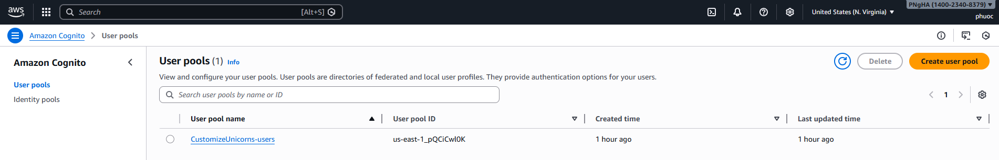
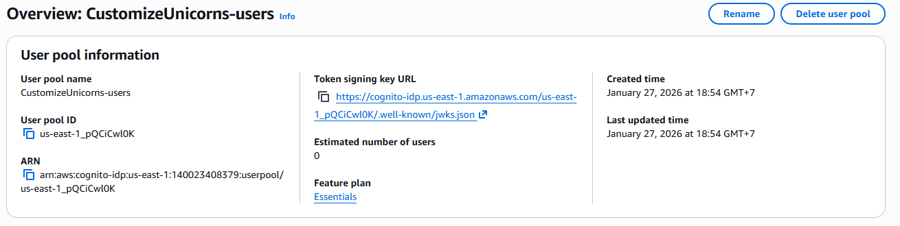
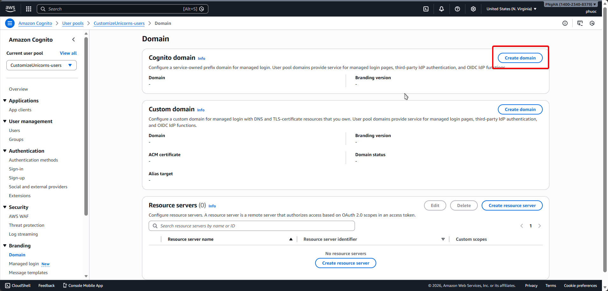
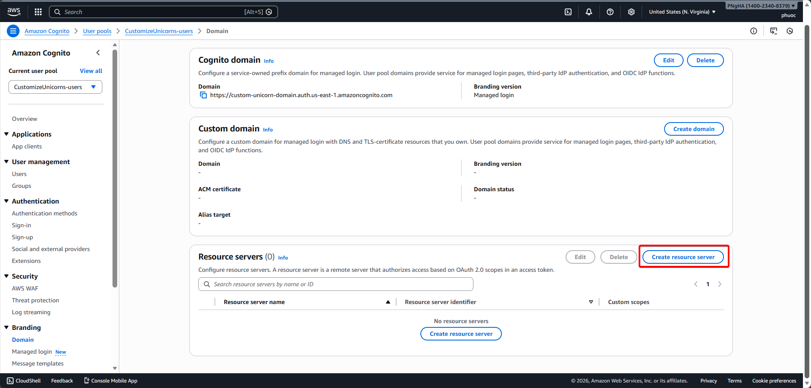
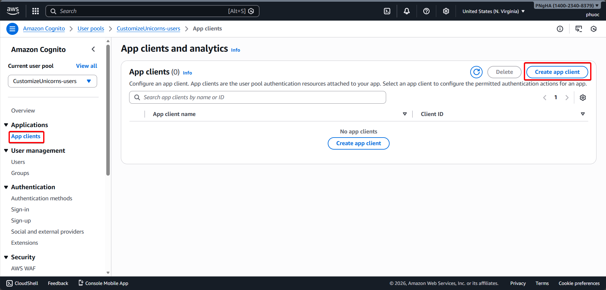
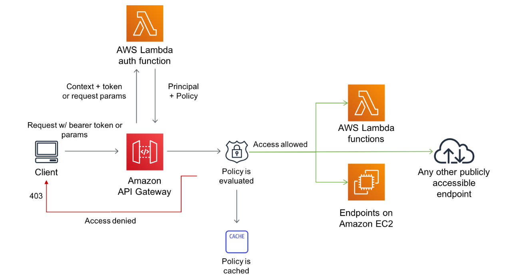
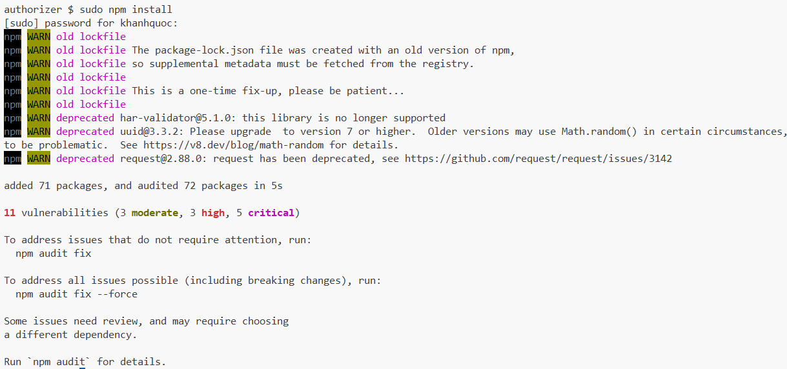
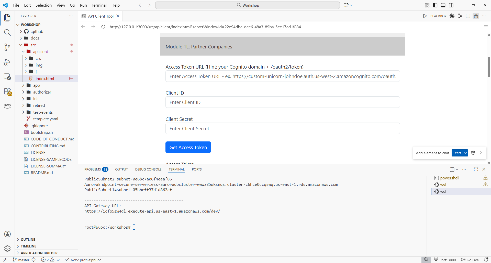
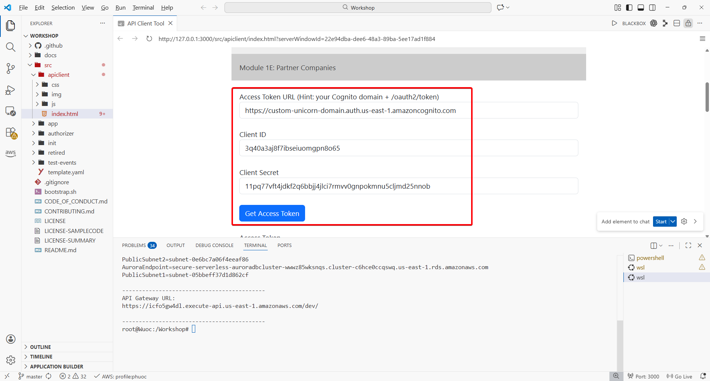
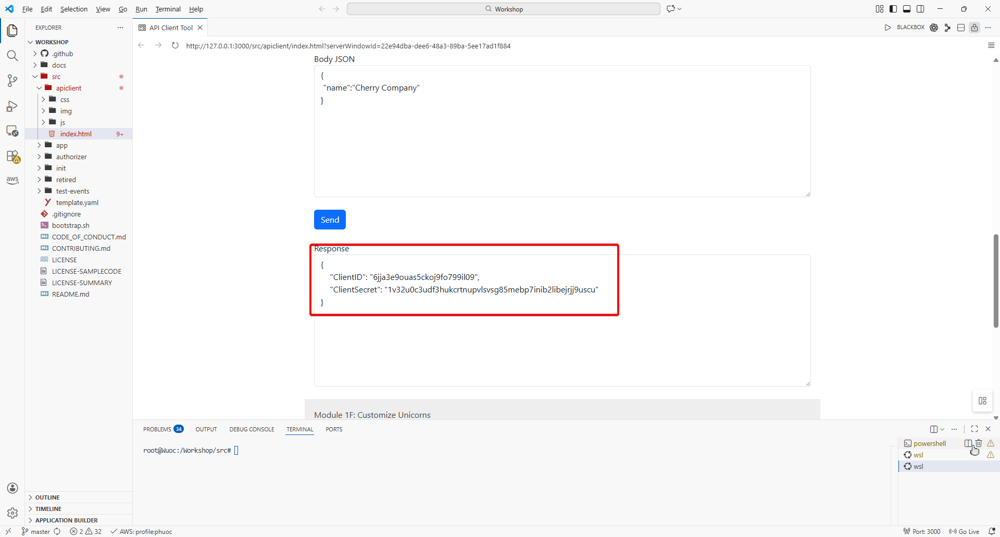

# Module 1: Add Authentication and Authorization

## Overview

The serverless app deployed in Module 0 is now open to anyone in the world to access. Attackers can submit any number of unicorn customizations and we have no way of knowing who really made the request.

To lock down access to the API to only trusted partners, we must add authentication and authorization to the API.

In this module, we will use **OAuth Client Credentials flow** with **Amazon Cognito** as the authorization server, and leverage **Lambda Authorizer** for API Gateway to inspect tokens and determine access policies based on token claims.

## Architecture
By the end of this module, your architecture will look like this:


---

## Module 1A: Cognito User Pool Setup

1. Review the Cognito User Pool in the Resources section of `src/template.yaml`

   

2. Go to the [AWS Cognito Console](https://console.aws.amazon.com/cognito/home)

   

3. Click on the user pool created by the SAM Template named `CustomizeUnicorns-users`

   

4. Under **Branding** left navigation menu, click on **Domain** to set up a unique Cognito domain. Click **Actions**, then select **Create Cognito domain**

   

5. Enter a unique domain name (e.g., `custom-unicorn-domain`) and click **Create Cognito domain**

   

6. Note down the full domain name in the format `https://<your-custom-name>.auth.<aws-region>.amazoncognito.com`

   

---

## Module 1B: Authorization Scopes

1. Go to **Branding > Domain** on the left navigation menu

2. Click **Resource servers** section and select **Create Resource Server**

   

3. Enter the following details:
   - **Resource Server Name**: `WildRydes`
   - **Resource Server Identifier**: `WildRydes`

   

4. In the **Scopes** section, add two scopes:
   - **Scope name**: `CustomizeUnicorn` (for 3rd party partners to customize unicorns)
   - **Scope name**: `ManagePartners` (for internal apps/admin to register partner companies)

   

5. Click **Create resource server**

   

---

## Module 1C: Admin Account

1. In the Cognito console, go to **Applications > App clients**. Click **Create app client**

   

2. Select **Machine-to-machine application** as the Application Type. Enter `Admin` for the app client name and click **Create app client**

   

3. On the **Admin** client detail page, click on the **Login pages** tab. Click **Edit**

   

4. Under **Managed login pages**, click **add callback url** and enter `https://aws.amazon.com`

   

5. Verify **Client Credentials** OAuth 2.0 grant type is selected

   

6. Under **Custom scopes**, select `WildRydes/ManagePartners`

   

7.  Scroll down and click **Save Changes**

    

8.  Under the **App client information** section, click the radio button **Show client secret**

    

9.  Copy the **Client ID** and **Client secret** for later use

    

---

## Module 1D: Lambda Authorizer

1. Review the Lambda authorizer workflow diagram

   

2. Review the DynamoDB table for ClientID to Company ID mapping in `src/template.yaml`

   

3. Review the Lambda authorizer code in `src/authorizer/index.js`

4. Install Node.js dependencies in the `src/authorizer` folder:

   ```bash
   cd /Workshop/src/authorizer
   npm install
   ```

   

5. Add the Custom Authorizer Function to the Resources section of `src/template.yaml`

   ```yaml
   CustomAuthorizerFunction:
    Type: AWS::Serverless::Function
    Properties:
     CodeUri: authorizer/
     Runtime: nodejs22.x
     Handler: index.handler
     Policies:
      - Statement:
        - Effect: Allow
          Action:
            - "dynamodb:*"
          Resource: "*"
     Environment:
      Variables:
       USER_POOL_ID: !Ref CognitoUserPool
       PARTNER_DDB_TABLE: !Ref PartnerDDBTable
   ```

   

6. Add the API Gateway Authorizer IAM Role to `src/template.yaml`

   ```yaml
   ApiGatewayAuthorizerRole:
    Type: AWS::IAM::Role
    Properties:
     AssumeRolePolicyDocument:
      Version: "2012-10-17"
      Statement:
       - Effect: "Allow"
         Principal:
          Service:
           - "apigateway.amazonaws.com"
         Action:
          - sts:AssumeRole
     Policies:
      - PolicyName: "InvokeAuthorizerFunction"
        PolicyDocument:
         Version: "2012-10-17"
         Statement:
          - Effect: "Allow"
            Action:
             - lambda:InvokeAsync
             - lambda:InvokeFunction
            Resource: !Sub ${CustomAuthorizerFunction.Arn}
   ```

   

7. Find the Swagger definition in `src/template.yaml` and locate the `### TODO: add authorizer` section

8. Replace the `### TODO: add authorizer` section with the security definitions:

   ```yaml
   securityDefinitions:
    CustomAuthorizer:
     type: apiKey
     name: Authorization
     in: header
     x-amazon-apigateway-authtype: custom
     x-amazon-apigateway-authorizer:
      type: token
      authorizerUri:
       Fn::Sub: arn:aws:apigateway:${AWS::Region}:lambda:path/2015-03-31/functions/${CustomAuthorizerFunction.Arn}/invocations
      authorizerCredentials:
       Fn::Sub: ${ApiGatewayAuthorizerRole.Arn}
      authorizerResultTtlInSeconds: 60
   ```

   

9. Uncomment the security lines in each API method in the `paths` section. Change the comment lines to active code:

   ```yaml
   security:
    - CustomAuthorizer: []
   ```

   

10. Save the `src/template.yaml` file

    

11. Navigate back to the `src` folder and validate the template:

    ```bash
    cd ..
    sam validate -t template.yaml --region $REGION
    ```

    

12. Deploy the updates using CloudFormation:

    ```bash
    aws cloudformation package --output-template-file packaged.yaml --template-file template.yaml --s3-bucket $DeploymentS3Bucket --s3-prefix securityworkshop --region $REGION && aws cloudformation deploy --template-file packaged.yaml --stack-name CustomizeUnicorns --region $REGION --capabilities CAPABILITY_IAM
    ```

    

13. After deployment completes, go to the [AWS API Gateway Console](https://console.aws.amazon.com/apigateway/home). Click into the `CustomizeUnicorns` API and verify the Authorization is set to `CustomAuthorizer` in Method Request

   

14. Test the API using the VS Code Server API Client. You should now receive **401 Unauthorized** errors

   

---

## Module 1E: Partner Companies

1. Open the API Client preview (Show Preview on `src/apiclient/index.html`)

   

2. Expand "Module 1E: Partner Companies" in the client

   

3. Ensure the base URL is your API Gateway endpoint. Fill Access Token URL (`<cognito-domain>/oauth2/token`), paste Admin `Client ID` and `Client Secret`

   

5. Click "Get Access Token" and verify token is returned

   

6. In "Register Partner", keep URL path `/partners`, set body, then Send

   ```json
   { "name": "Cherry Company" }
   ```

7. Copy the returned `ClientId` and `ClientSecret` for the new partner

   

---

## Module 1F: Customize Unicorns

1. Expand "Module 1F: Customize Unicorns" in the API Client

2. Copy the partner company's `Client ID` and `Client Secret` from Module 1E into the textboxes


3. Click "Get Access Token" to request a token for the partner company

   

4. Verify the new Access Token is returned in the Response section

   

5. Scroll down to the "Create Customization" POST request (path `/customizations`)

6. Enter the following JSON in the Body JSON textbox:

   ```json
   {
     "name": "Cherry-themed unicorn",
     "imageUrl": "https://en.wikipedia.org/wiki/Cherry#/media/File:Cherry_Stella444.jpg",
     "sock": "1",
     "horn": "2",
     "glasses": "3",
     "cape": "4"
   }
   ```

7. Click the "Send" button to create the customization

8. Verify the response contains the `customUnicornId`

   

---


