# Module 10: WAF

## Overview

AWS WAF (Web Application Firewall) is a web application firewall that helps protect your web applications from common web exploits that could:
- Affect application availability
- Compromise security
- Consume excessive resources

---

## (Optional) Module 10: Attack Your API with SQL Injection!

> **Note:** If you have completed **Module 5: Input validation on API Gateway**, your API now has some basic input validation in place for the JSON request body. However, it turns out our application is still vulnerable to SQL injection attacks as part of the request URI. This optional section shows how you can perform the attack.

### Perform SQL Injection Attack

1. In the **API Client**, scroll down and click the **Module 10: WAF** tab to expand the section

2. Click the **Get Access Token** button to retrieve a fresh token

3. Update the URL to include the SQL injection payload after the customization ID:

  ```
  {{base_url}}/customizations/1; drop table Custom_Unicorns;
  ```

4. Click **Send**

  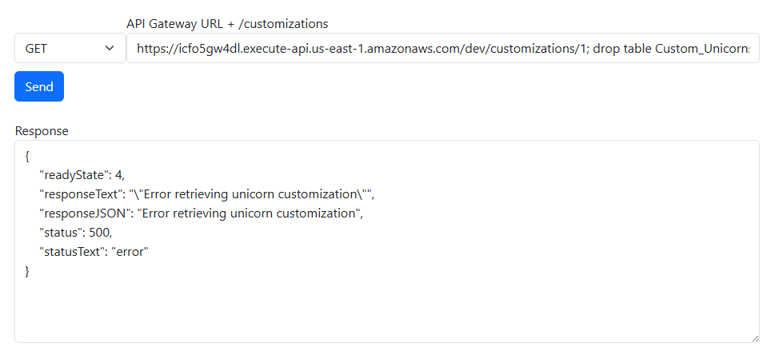

5. You may get an **"Error querying"** response back because the SQL injection messed up the database query so not all of it succeeded

  > **Note:** You can check the CloudWatch Logs for the `CustomizeUnicorns-CustomizeUnicornFunction` Lambda function to see what SQL queries got executed


6. However, the injected query to drop the `Custom_Unicorns` table should have succeeded


### Recover from the Attack

8. To recover from this, go to your VS Code Server terminal tab

9. Connect to the database again through the mysql command line:

  ```bash
  cd /Workshop/src
  mysql -h 127.0.0.1 -P 3307 -u admin -p'<Password>' --ssl-mode=REQUIRED
  ```
   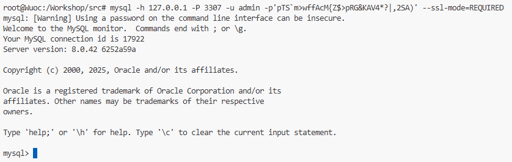
  > **Note:** If you have gone through Module 4 and your DB password may have been rotated by Secrets Manager, you can retrieve the new password by going to Secrets Manager and clicking the **Retrieve secret value** button.

10. In the MySQL CLI prompt, run the `show tables` command to verify the `Custom_Unicorns` table is gone:

  ```sql
  use unicorn_customization;
  show tables;
  ```

  

11.  Rerun the DB initialization script to recreate the `Custom_Unicorns` table:

  ```sql
  drop table Capes, Glasses, Horns, Socks;
  source init/db/queries.sql;
  ```
   
  > **Expected Error:** You should see the output includes this error message: `ERROR 1062 (23000): Duplicate entry 'Placeholder company' for key 'NAME'`. This is expected because we didn't want to overwrite the `company` table. You can ignore this error message.

12. List the tables again to verify the `Custom_Unicorns` table is recreated:

  ```sql
  show tables;
  ```
   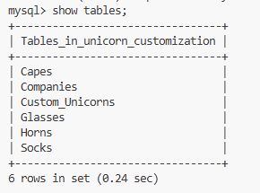
---

## Module 10A: Create ACLs

In this section, we'll create an AWS WAF (Web Application Firewall) ACL to provide additional protection for our API.

### Create a WAF ACL

1. Go to the [AWS WAF Console](https://console.aws.amazon.com/wafv2/homev2)

2. Click on **"Create Web ACL"**

3. Click on **Create web ACL** on the WAF V2 console
   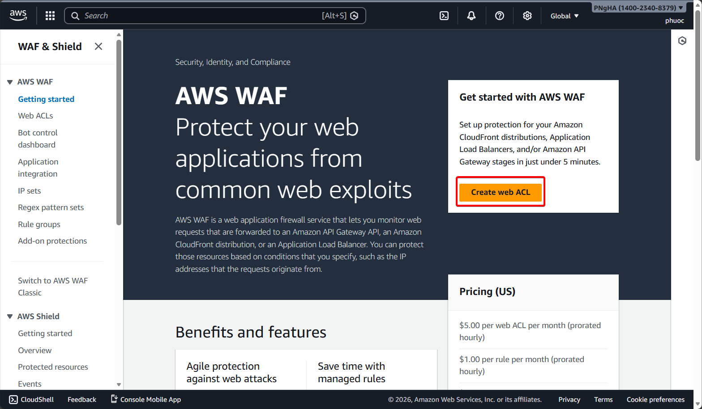
4. In **Step 1** of the ACL creation wizard, fill in:

  - **Web ACL Name**: `ProtectUnicorn`
  - **CloudWatch metric name**: This should be automatically populated for you
  - **Region**: Select the AWS region you chose for previous steps of the workshop
  - **Resource type**: Pick `Regional resources (Application Load Balancers, Amazon API Gateway REST APIs, Amazon App Runner services, AWS AppSync GraphQL APIs, Amazon Cognito user pools and AWS Verified Access Instances)`
  - **Associated AWS Resources**: Click **Add AWS Resources** button
    - Select the API Gateway we deployed previously: `CustomizeUnicorns - dev`
    - Click **Add**

  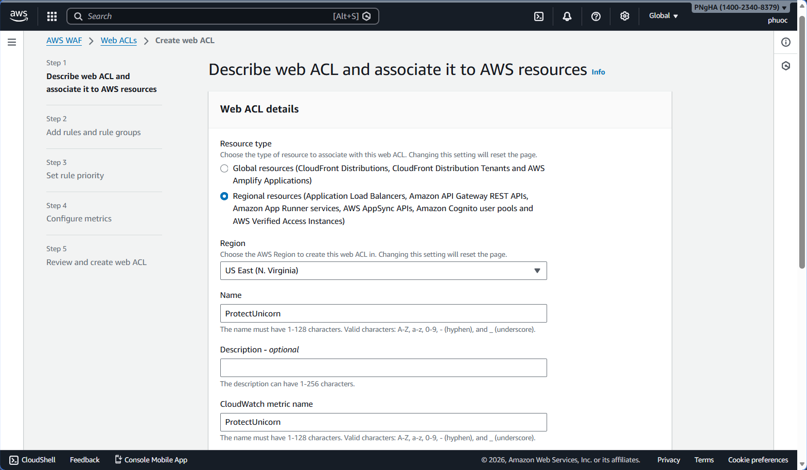
  

5. Leave the **Web request body inspection** section set to defaults (ex. Default 16KB for the body size limit)

2. Click **Next**

---

## Module 10B: Create Rules

In this section, we'll create three different WAF rules to protect our API from various types of attacks.

### Rule 1: Restrict Maximum Request Body Size

1. In the **"Add rules and rule groups"** page, click **"Add rules"** then select **"Add my own rules and rule groups"**

  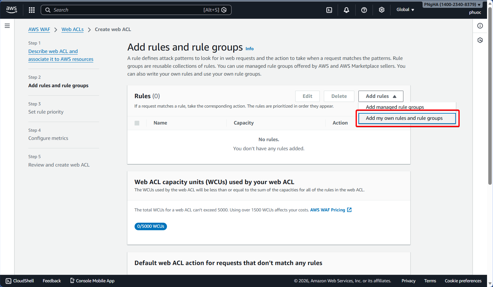

2. Configure the rule with the following settings:

  - **Name**: `LargeBodyMatch`
  - **Type**: `Regular rule`
  - **If a request**: Select "matches the statement"
  - **Inspect**: Body
  - **Content type**: JSON
  - **JSON Match type**: All
  - **How AWS WAF should handle the request if the JSON in the request body is invalid**: None
  - **Content to inspect**: Full JSON Content
  - **Match Type**: Size greater than
  - **Size in bytes**: `3000`
  - **Text Transformation**: None
  - **Oversize handling**: Continue - Inspect the contents that are within the size limitations according to the rule inspection criteria
  - **Then Section**: Ensure **"Block"** is selected

3. Click **Add rule**

4. You will be returned to the "Add rules and rule groups" page (step 2)

  

### Rule 2: SQL Injection Protection

5. In the **"Add rules and rule groups"** page, click **"Add rules"** then select **"Add my own rules and rule groups"**

6. Configure the rule:

  - **Name**: `SQLinjectionMatch`
  - **Type**: `Regular Rule`
  - **If a request**: Select "matches at least one of the statements (OR)"

7. Add **Statement 1** (Inspect Body - JSON):

  - **Inspect**: Body
  - **Content**: JSON
  - **Match type**: Contains SQL Injection attacks
  - **Oversize handling**: Continue - Inspect the contents that are within the size limitations according to the rule inspection criteria

8. Click **"Add another statement"**

9. Add **Statement 2** (Inspect URI Path):

  - **Inspect**: URI path
  - **Match type**: Contains SQL Injection attacks
  - **Text transformation**: URL Decode

10. Click **"Add another statement"**

11. Add **Statement 3** (Inspect Body - URL Decode):

  - **Inspect**: Body
  - **Match type**: Contains SQL Injection attacks
  - **Text transformation**: URL Decode
  - **Oversize handling**: Continue - Inspect the contents that are within the size limitations according to the rule inspection criteria

12. Click **"Add another statement"**

13. Add **Statement 4** (Inspect Query String):

  - **Inspect**: Query String
  - **Match type**: Contains SQL Injection attacks
  - **Text transformation**: URL Decode

14. Click **Add Rule**

   

### Rule 3: Rate-Based Rule (Request Flood Prevention)

15. In the **"Add rules and rule groups"** page, click **"Add rules"** then select **"Add my own rules and rule groups"**

  

16. Configure the rate-based rule:

  - **Name**: `RequestFloodRule`
  - **Rule type**: `Rate-based rule`
  - **Rate limit**: `2000`
  - Keep everything else as defaults

17. Click **Add Rule**

  

### Finalize WAF Configuration

18. You should now see 3 rules similar to the screenshot below

19. Ensure all three rules have the **Action** of `Block`

20. Under **"Default web ACL action for requests that don't match any rules"**, select **`Allow`** for **Default action**

  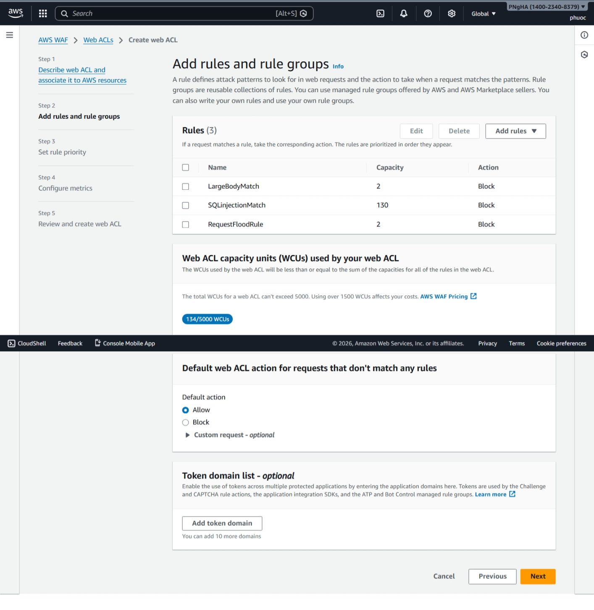

21. Click **Next**

22. Keep all defaults under the **"Set Rule Priority"** section, then click **Next** again
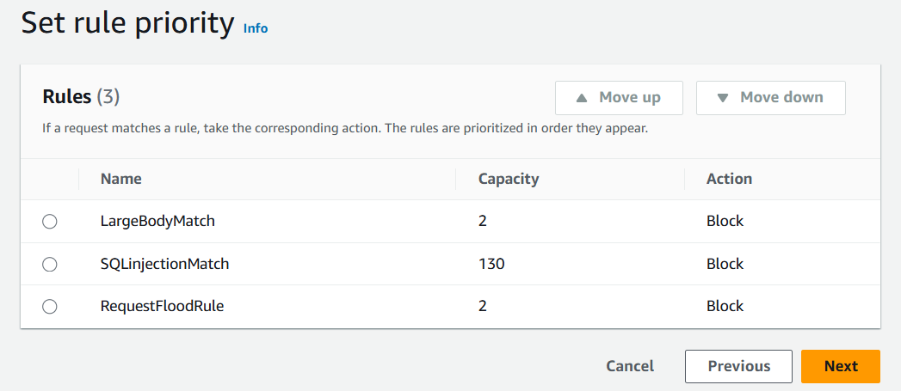
23. In the **"Configure Metrics"** page, use the defaults and click **Next**

24. Finally, on the **"Review and create web ACL"** page, review the selections and click **Create web ACL**

25. Allow a few minutes for the WAF Web ACL to be created


### Verify WAF Association

26. Navigate to your **API Gateway** → **API Stages** to confirm your WAF Web ACL has been associated with your API Gateway stage

27. If your ACL is not associated, edit the stage details and select your Web ACL under the **Web application firewall (AWS WAF)** section

  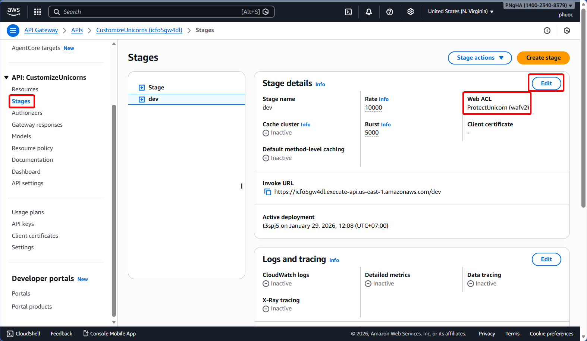

**Success!** You have now added a WAF to protect your API Gateway stage!

---

## Module 10C: Test Requests

Now that we have WAF rules configured, let's test to ensure they're working correctly to block malicious requests while allowing legitimate traffic.

### Test 1: Verify Valid Requests Pass Through

1. First, send some valid requests using the **API Client** to make sure well-behaving requests are getting through


### Test 2: Test Large Request Body Block

2. Switch to the **API Client** and click the **Module 10C: Test Requests** tab to expand the section

3. Click the **Get Access Token** button to retrieve a fresh token

4. Copy the JSON data below into the **Body JSON** textbox and click **Send**:

  ```json
  { 
    "name":"my custom unicorn",
    "imageUrl":"https://abc.efg.com/YA3K7yOwfmKhD1SdZ0MDB9C97RnJ3vb74WmoPOGJb2crs04okE2TcghSVgMWBLZ0c7rYZA5sjPWdfU7GJsRnEexwqgVfq2c94jEYdBCyxrZA3bZY36MiBnQZDrMyMMq1I8WJ7U4otss7mNWyQON0suZFXGCV7g7Z15dh14FIemSrkw3MzBLjsoAGTaz4VW1Ftljt5FCyJG3GtCSRvIoBkJ1YNiqKDRuiyFud7RgxBTXJEj3VvpTtT5CfWK...",
    "sock":"1",
    "horn":"2",
    "glasses":"3",
    "cape":"2"
  }
  ```

5. You should see your request getting blocked with a **403 Forbidden** response

  > **Note:** It may take a minute for WAF changes to propagate. If your test request went through successfully, retry a few times until you start receiving 403 errors as WAF takes effect.

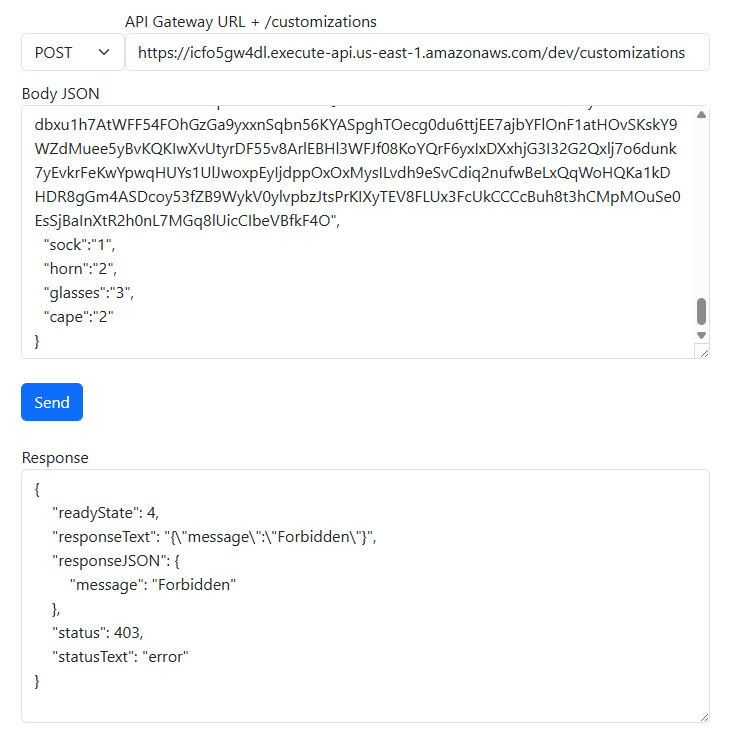

### Test 3: Test SQL Injection Block

6. Next, let's try a request with a SQL injection attack in the request URI for a **GET /customizations/{id}** request

7. In the **API Client**, choose the **GET Custom_Unicorn** request

8. Replace the URL with:

  ```
  {{base_url}}/customizations/1; drop table Custom_Unicorns;
  ```

9. Click **Send**

10. You should see your request getting blocked with a **403 Forbidden** or an **Error** response


### View WAF Metrics and Logs

11. The WAF console gives you metrics and sample requests that are allowed/denied by the WAF rules

12. You can find this information by going to the **WAF console**, under **Web ACLs**, **Protection Packs**, and select the WAF we just created

13. Select **View dashboard, logs, and sampled requests** on the right side of the screen

  > **Note:** It can take a few minutes before the metrics and sample requests start showing up in the WAF console.

  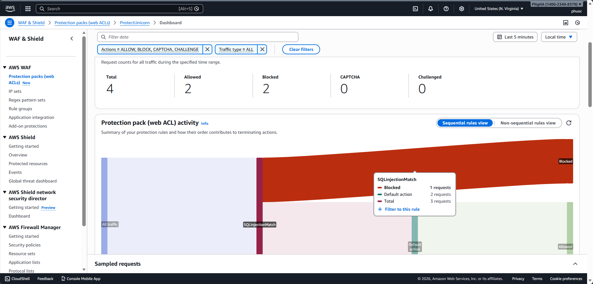

---

