# Module 2: Lambda IAM

## Overview
Lambda functions are an important part of serverless architecture. You can use AWS Identity and Access Management (IAM) to manage access to Lambda and resources such as functions and layers.

Every Lambda function has an IAM role called an **execution role**. In this role, you can attach a policy that defines the permissions your function needs to access other AWS services and resources.

## Module Sections

### Module 2A: Scoped Down Permission using IAM Access Analyzer

1. Open the Lambda Analytics function code in `src/app/customUnicornAnalytics.js`

  

2. Open the [AWS Lambda Console](https://console.aws.amazon.com/lambda/home) and search for `CustomUnicornAnalyticsFunction`

  

3. Click on the function to open its detail page

  

4. Go to **Configuration > Permissions** tab. Click on the **Execution role name** to open the IAM role

5. Review the attached permissions (note: currently has AdministratorAccess)

  

6. Scroll down to "Generate policy based on CloudTrail events" and click **Generate Policy**

7. On the Generate policy screen:
   - **Time period**: Select "Last 1 day"
   - **Region**: Select "US East (N. Virginia)"
   - **CloudTrail Trail**: Select "Serverless-Security-Workshop-Trail"
   - **Service role**: Select "Create and use a new service role"

  

8. Click **Generate Policy** and wait for completion

9. Wait for the status to show **Success** (may take a few minutes)

  

10. Click **View generated policy**

11. Review the generated policy showing DynamoDB and Secrets Manager actions

12. Select the appropriate actions:
    - **DynamoDB**: Select `PutItem`
    - **Secrets Manager**: Select `GetSecretValue` (if Module 4 was completed)

  

13. Click **Next** to proceed to customization

    

14. On the Customize Permissions page, remove unnecessary policy statements (keep only DynamoDB and Secrets Manager)

    

15. Set the Resource ARN for DynamoDB table and Secrets Manager secret

  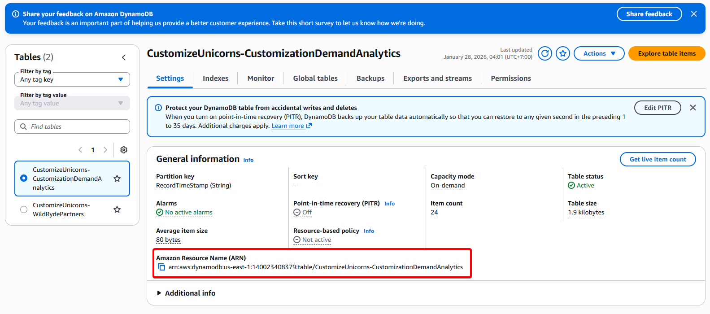
  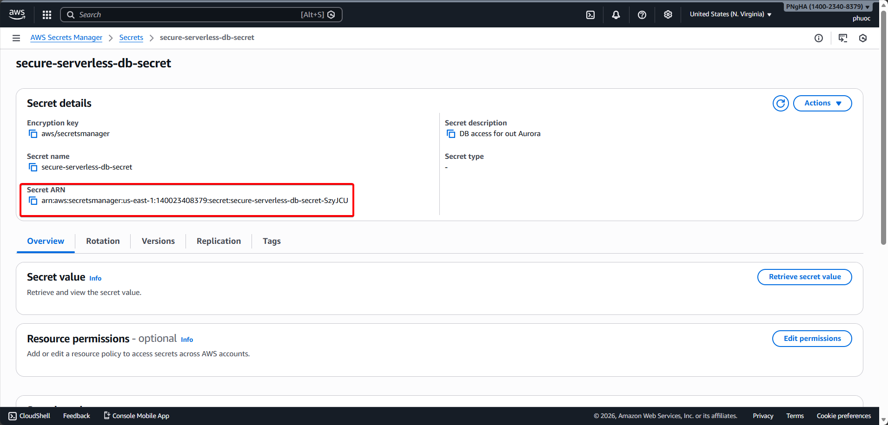
  

16. Click **Next** to continue

17. Enter policy name: `CustomUnicornAnalyticsScopedDownPolicy`

  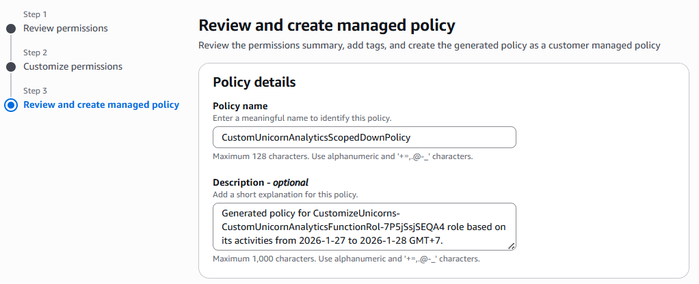

18. Click **Create and attach policy**

  

19. Back on the IAM role page, remove the **AdministratorAccess** policy by clicking **Remove**

  

20. Verify in the Lambda console that the execution role is updated

  

21. Navigate to the [DynamoDB Console](https://console.aws.amazon.com/dynamodb/home) and verify new records are being inserted into `CustomizeUnicorns-CustomizationDemandAnalytics` table

  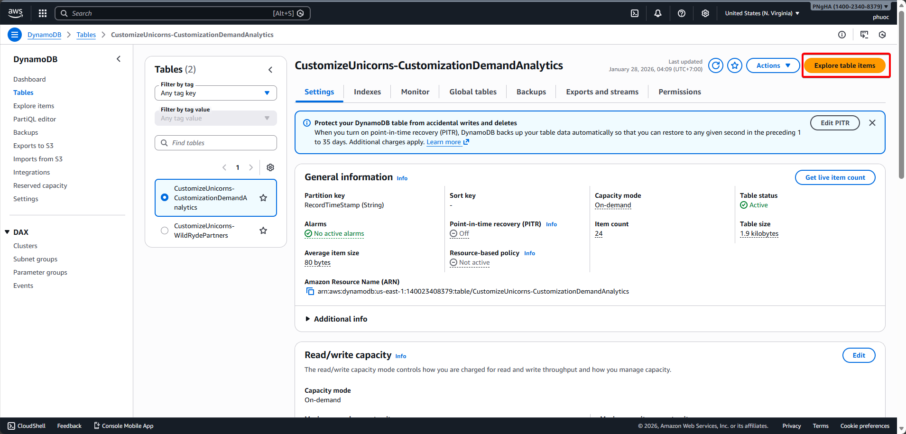

  

---

### Module 2B: Attribute Based Access Control (ABAC)

#### Part 1: Explore the Infrastructure

1. Open the [AWS IAM Console](https://console.aws.amazon.com/iam/home)

2. Click on **Users** under Access Management in the left navigation

3. Search for and open **serverless-dev-user**

  

4. Review the attached policy allowing `sts:AssumeRole` and `sts:TagSession`

  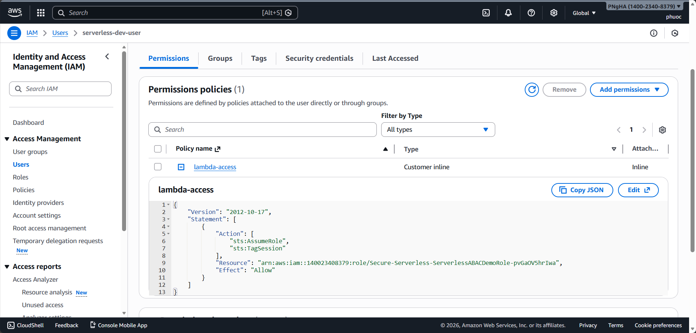

5. Click on **Roles** in the left navigation. Search for **ServerlessABACDemoRole** and open it

  

6. Review the attached managed policies:
   - **ServerlessABACDemoPolicyLambdaInvoke** (GetFunction, InvokeFunction)
   - **ServerlessABACDemoPolicyListLambdaIAM** (List and Get permissions)

  

7. Copy the "Link to switch roles in console" URL from the top right (for later use)

   

#### Part 2: Log In as Developer User and Test Function Invoke

9. Open a new **Incognito/Private window** and navigate to your AWS account login page

   ```
   https://ACCOUNT_ID.signin.aws.amazon.com/console/
   ```

10. Log in with developer credentials:
    - **IAM user name**: `serverless-dev-user`
    - **Password**: `pA$$woRd1`

  

11. After login, paste the Switch Role URL copied earlier

12. Verify you've switched to **ServerlessABACDemoRole**

  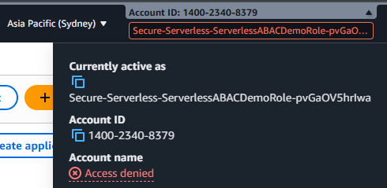

13. Open the [Lambda Console](https://console.aws.amazon.com/lambda/home) and search for **CustomUnicornAnalyticsFunction**

  

14. Click on the function to open it
15. Go to **Configuration > Tags** tab

16. Verify the function is tagged with `application: customizeUnicorn`

  

17. Click on the **Test** tab and click **Test** button to invoke the function

18. Verify the function executes successfully

  

#### Part 3: Modify Permission to Enforce Tag-Based Access

19. Go back to your original browser window (logged in as IAM Admin)

20. Open **ServerlessABACDemoRole** and go to Permissions policies

21. Expand **ServerlessABACDemoPolicyLambdaInvoke** and click **Edit**

  

22. Add the following condition to the policy:

    ```json
    "Condition": {
      "StringEquals": {
        "aws:ResourceTag/application": "${aws:PrincipalTag/application}"
      }
    }
    ```

  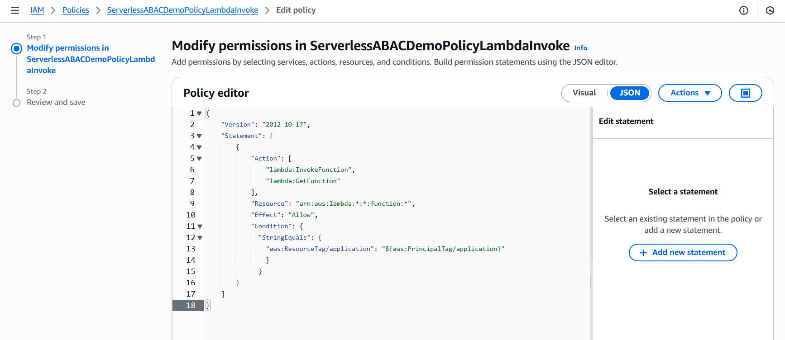

23. Click **Next** to review changes

  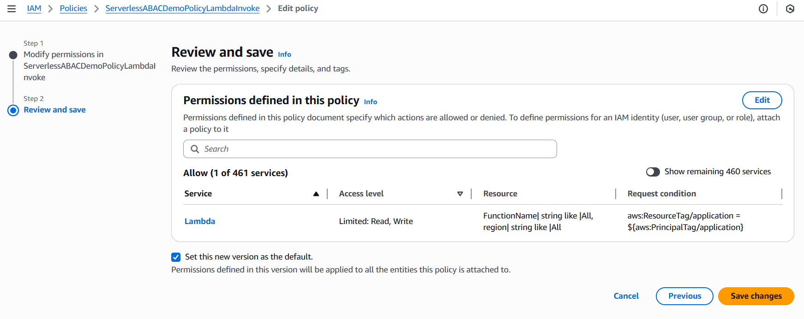

24.  Click **Save Changes**

#### Part 4: Verify Developer User Cannot Invoke Function

25. Go back to the developer user's browser window

26. In the Lambda Console, click **Test** button again to try invoking the function

27. Verify the execution fails with an access denied error

  

#### Part 5: Tag Developer Role with Matching Tag

28. Go back to the IAM Admin browser window

29. Open **ServerlessABACDemoRole** and click on the **Tags** tab

30. Click **Add new tag**

  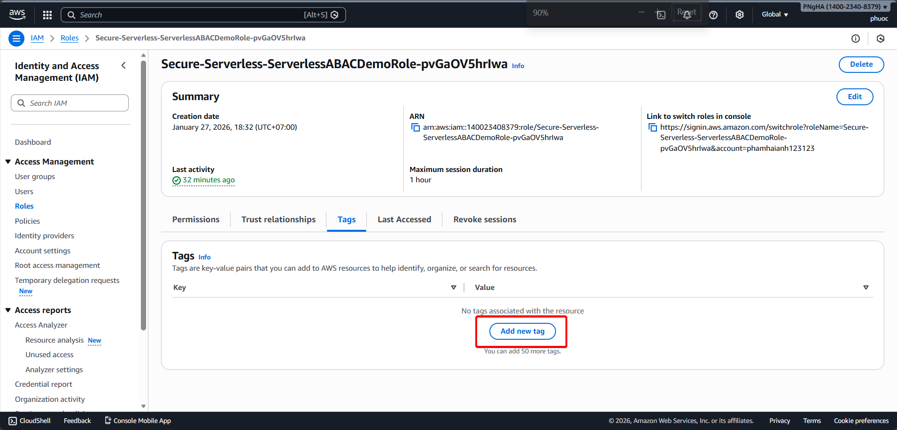

31. Add tag:
    - **Key**: `application`
    - **Value**: `customizeUnicorn`

  

32.  Click **Save changes**

#### Part 6: Verify Developer Can Now Invoke Function

33. Go back to the developer user's browser window

34. In the Lambda Console, click **Test** button to invoke the function

35. Verify the function now executes successfully

  

---

### Module 2C: Permission Boundary

#### Part 1: Modify Developer Role to Allow IAM Role Creation

1. Open the [AWS IAM Console](https://console.aws.amazon.com/iam/home)

2. Click on **Policies** under Access Management in the left navigation

3. Search for and open **ServerlessPermissionBoundaryDemoIAMActionsPolicy**

  

4. Review the policy allowing CreateRole, DeleteRole, and other IAM actions

5. Note that the resource (IAM Role) name is enforced to start with `Serverless-`

  

6. Click on **Roles** in the left navigation

7. Search for and open **ServerlessABACDemoRole**

  

8. Click **Add permissions** > **Attach policies**

9. Search for **ServerlessPermissionBoundaryDemoIAMActionsPolicy**

10. Check the policy and click **Add permission**

  

1.  Leave this browser window open as you will return to modify permissions later

#### Part 2: Test Developer User Can Create IAM Roles

12. Open your developer user browser (ServerlessABACDemoRole session)

13. Open the [AWS IAM Console](https://console.aws.amazon.com/iam/home)

14. Click **Roles** under Access management in the left navigation

15. Click **Create role** button

  

16. On Select trusted entity page, select **Trusted entity type** as **AWS Service**

17. Select **Use case** as **Lambda**

18. Click **Next** button

  

19. On Attach permissions page, search for **AWSLambdaExecute**

20. Select **AWSLambdaExecute** policy and click **Next**

  

21. On Name, review, and create page, enter role name: `Serverless-CustomAnalyticsExecutionRole`

22. Click **Create role**

  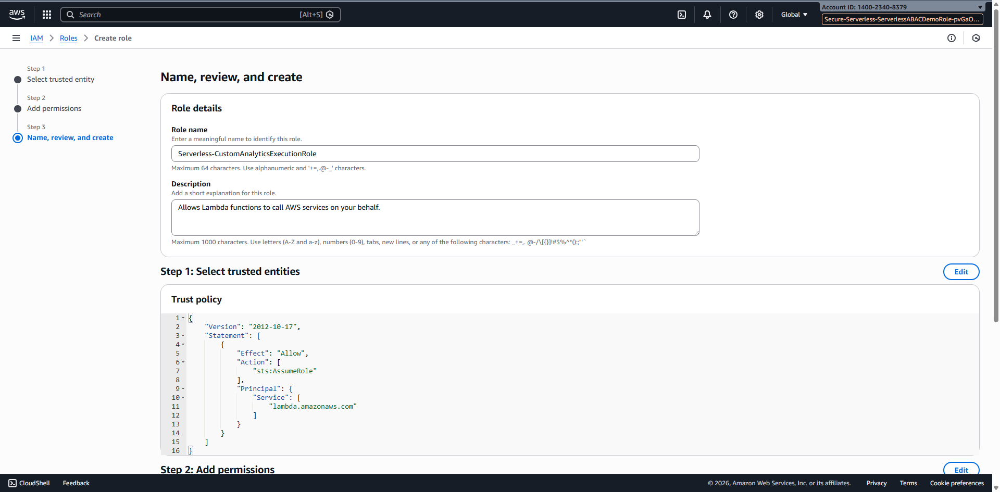
  

23. Verify the role was created successfully

24. Open the [AWS Lambda Console](https://console.aws.amazon.com/lambda/home)

25. Click **Create function** button

  

26. Enter function name: `ServerlessUnicornCustomFunction`

27. Select **Runtime** as your preferred Node.js version

28. Under Execution role, select **Use an existing role**

29. Select the role you just created: `Serverless-CustomAnalyticsExecutionRole`

30. Click **Create function**

  
  

31. Verify the function was created successfully
  
32. Leave this browser window open for later testing

#### Part 3: Review and Apply Permission Boundary Policy

33. Go back to the IAM Admin browser window (WSParticipantRole session)

34. Open the [AWS IAM Console](https://console.aws.amazon.com/iam/home)

35. Click on **Policies** in the left navigation

36. Search for **ServerlessPermissionBoundaryDemoBoundaryPolicy**

37. Click to open the policy and review it

  

38. Note this policy allows limited operations on DynamoDB, S3, and CloudWatch Logs

39. Copy the ARN of this policy (shown at the top right) to your notes

40. Click on **Policies** again in the left navigation

41. Search for **ServerlessPermissionBoundaryDemoIAMActionsPolicy**

42. Click to open and click **Edit policy** button

  

43. Add the following boundary condition to the policy:

    ```json
    "Condition": {
      "ArnEquals": {
        "iam:PermissionsBoundary": "arn:aws:iam::YOUR_ACCOUNT_ID:policy/ServerlessPermissionBoundaryDemoBoundaryPolicy"
      }
    }
    ```
  

44.  Click **Next** to review changes

45.  Click **Save changes**
    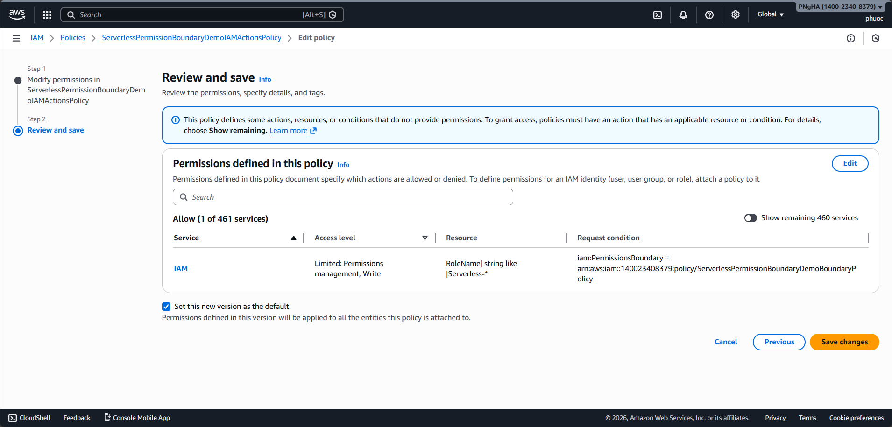

#### Part 4: Verify Developer Must Specify Permission Boundary

46. Go back to the developer user browser (ServerlessABACDemoRole session)

47. Open the [AWS IAM Console](https://console.aws.amazon.com/iam/home)

48. Click **Roles** under Access management in the left navigation

49. Click **Create role** button
  
50. On Select trusted entity page, select **Trusted entity type** as **AWS Service**

51. Select **Use case** as **Lambda**

52. Click **Next** button
  
53. On Attach permissions page, search for **AdministratorAccess**

54. Select **AdministratorAccess** policy and click **Next**

  
  

55. On Name, review, and create page, enter role name: `Serverless-CustomizeUnicornDemandRole`

56. Click on **Set permissions boundary** section

57. Check **Use a permissions boundary to control the maximum role permissions**

58. Search for and select **ServerlessPermissionBoundaryDemoBoundaryPolicy**

  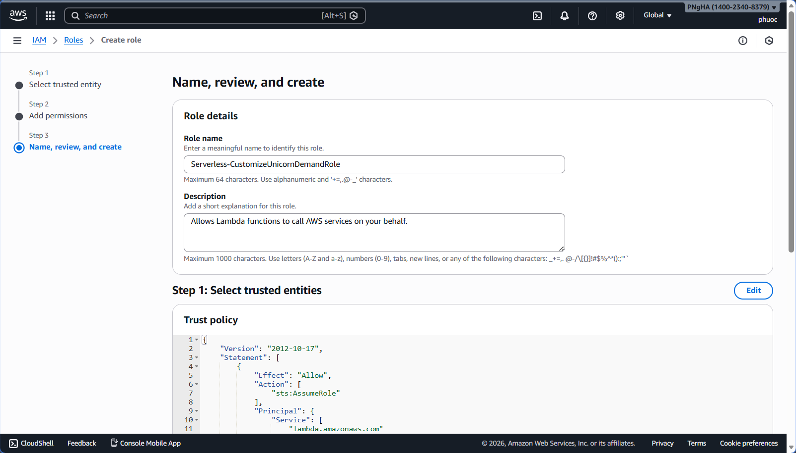
  

60.  Click **Create role**
  

61. Verify the role was created successfully with the permission boundary

#### Part 5: Create Lambda Function with Boundary-Constrained Role

62. Open the [AWS Lambda Console](https://console.aws.amazon.com/lambda/home)

63. Click **Create function** button
  
1.  Enter function name: `ServerlessUnicornCustomAnalyticsFunction`

2.  Select **Runtime** as your preferred Node.js version

3.  Under Execution role, select **Use an existing role**

4.  Select the role you just created: `Serverless-CustomizeUnicornDemandRole`
  
  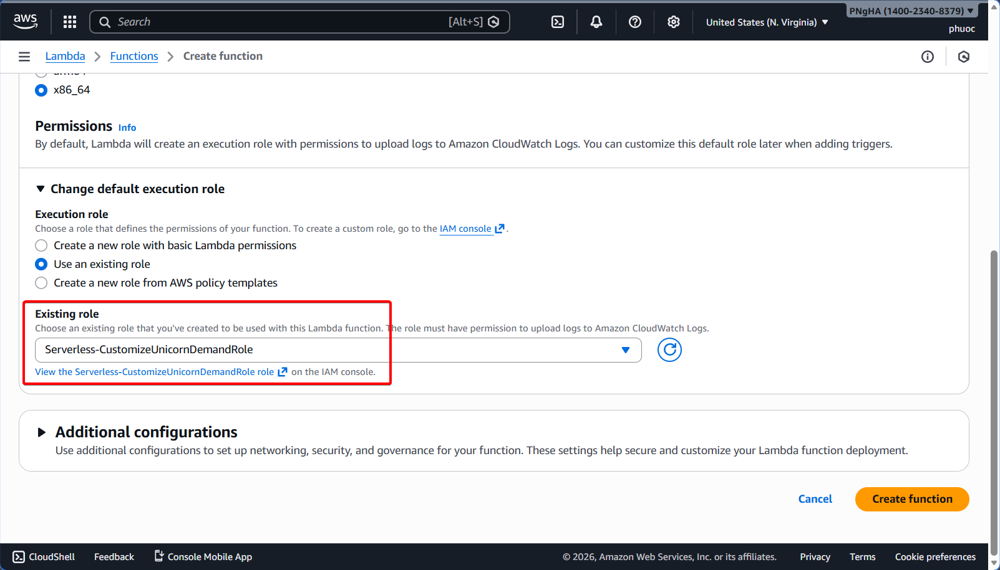

68. Click **Create function**

69. Verify the function was created successfully
  
70. Confirm that the permission boundary successfully limited the developer's permissions while allowing role creation

---