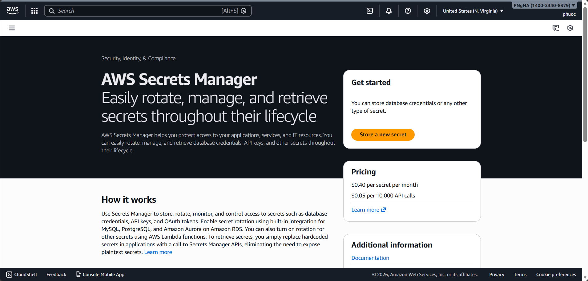
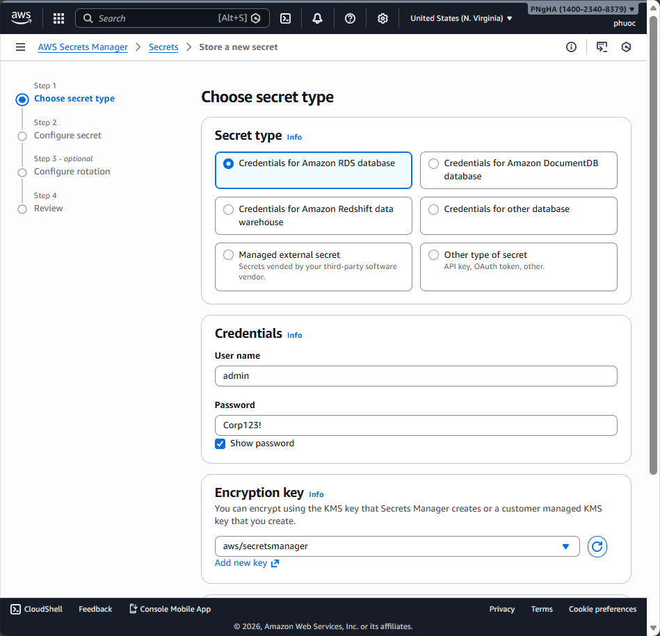
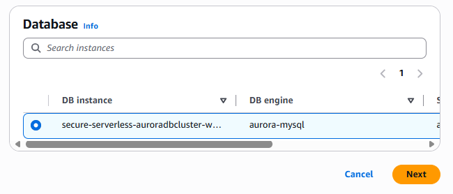
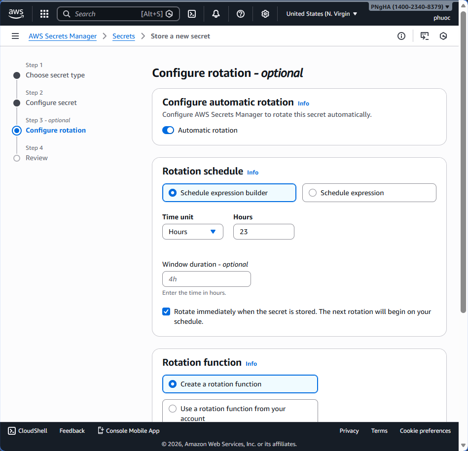
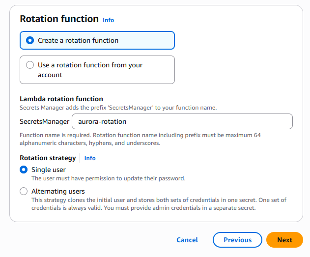
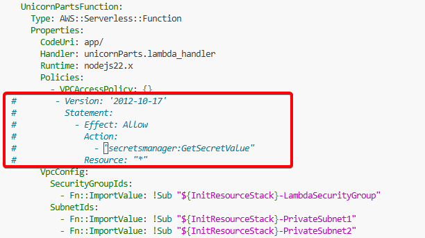
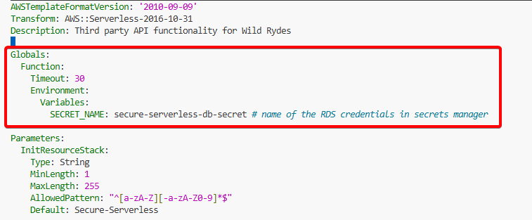
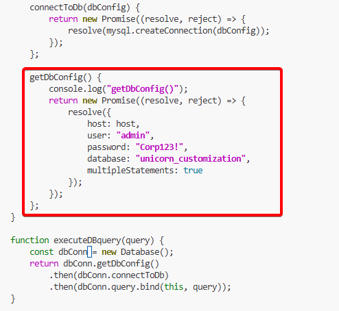

# Module 4: Secrets

## Overview
Hardcoding database credentials and connection information is not a best practice from both security and operational perspectives.

### Security Concerns
- Any data breach exposing code could expose credentials
- Risk of accidentally committing secrets to public repositories
- Credentials visible in version control history

### Operational Concerns
- Difficult to automate deployments across different environments
- Manual intervention required for environment-specific values
- Slow CI/CD pipeline execution
- Version control conflicts with different environments

## Solution: AWS Secrets Manager
AWS Secrets Manager handles database credentials securely and provides:
- Secure credential storage
- Automatic password rotation (integrates with RDS)
- Controlled access through IAM policies
- Audit trail of credential access
- Support for multiple databases

## Module Sections

### Module 4A: Create Secret

1. Go to the [AWS Secrets Manager Console](https://console.aws.amazon.com/secretsmanager/home)

  

2. Click **Store a new secret**
3. You may see warnings about listing Redshift clusters or KMS aliases - these can be ignored
4. Select **Credentials for RDS database** as the secret type

5. Fill in the credential values:
   - **Username**: `admin`
   - **Password**: `Corp123!`
   - **Encryption Key**: Select `aws/secretsmanager`
   - **Database**: Select your Aurora cluster

  
  


6. Configure the secret details:
   - **Secret name**: `secure-serverless-db-secret`
   - **Description**: 'DB access for out Aurora'

  


7. Configure automatic rotation:
   - Select **Automatic rotation**
   - **Rotation Schedule**: Select `Schedule expression builder`
   - **Time Unit**: `Days`
   - **Days**: `30`

  

8.  Configure the rotation function:
    - **Rotation function**: Select `Create a rotation function`
    - **Function name**: `aurora-rotation`
    - **Rotation strategy**: Select `Single user`

  


9.  Review the example code (optional)

  

10. Click **Store** to create the secret

11. Verify the success message showing the secret was stored and CloudFormation resources created

  

12. Click on the secret name to view details

  

13. Click **Retrieve secret value** to verify the stored credentials

  

---

### Module 4B: Add Permission

1. Open `src/template.yaml` in VS Code Server

2. Search for the Secrets Manager policy block (you will find 3 occurrences)

3. Locate the first commented Secrets Manager policy block:
4. Uncomment the first policy block
  
5. Locate the second commented Secrets Manager policy block
   
6. Uncomment the second policy block
  

7. Locate the third commented Secrets Manager policy block
  
8. Uncomment the third policy block
  

10.  Navigate to the `Globals` section and verify the `SECRET_NAME` environment variable:

  ```yaml
    Globals:
      Function:
        Timeout: 30
        Environment:
          Variables:
            SECRET_NAME: secure-serverless-db-secret
  ```
  
11. Save the `src/template.yaml` file

---

### Module 4C: Modify App Code

1. Open `src/app/dbUtils.js` in VS Code Server

2. Locate the line `const PARTNER_COMPANY_TABLE = "Companies";`

3. Add the following lines after that constant:

   ```javascript
   // Load the AWS SDK
   import { SecretsManagerClient, GetSecretValueCommand } from "@aws-sdk/client-secrets-manager";
   const secretName = process.env.SECRET_NAME;
   var secret;

   // Create a Secrets Manager client
   const client = new SecretsManagerClient({});
   ```

  

4. Verify environment variables are defined in `template.yaml` Global section

5. Find the `getDbConfig` method in `dbUtils.js`

6. Locate the resolve statement that currently has hardcoded credentials:

   ```javascript
   resolve({
     host: host,
     user: "admin",
     password: "Corp123!",
     database: "unicorn_customization",
     multipleStatements: true
   });
   ```

  

7. Replace the hardcoded credentials with Secrets Manager code:

   ```javascript
   const command = new GetSecretValueCommand({SecretId: secretName});
   client.send(command) 
   .then(response => {
     if (response.SecretString !== "") {
       secret = response.SecretString;
       resolve({
         host: JSON.parse(secret).host,
         user: JSON.parse(secret).username,
         password: JSON.parse(secret).password,
         database: "unicorn_customization",
         multipleStatements: true
       });
     } else {
       reject("Cannot parse DB credentials from secrets manager.");
     }
   })
   .catch(error => {
     console.error(error);
     if (error.code === 'ResourceNotFoundException')
       reject("The requested secret " + secretName + " was not found");
     else if (error.code === 'InvalidRequestException')
       reject("The request was invalid due to: " + error.message);
     else if (error.code === 'InvalidParameterException')
       reject("The request had invalid params: " + error.message);
     else
       reject(error.message);
   });
   ```

  

8. Verify the `getDbConfig` method now looks correct with Secrets Manager integration

9. Save the `src/app/dbUtils.js` file

---

### Module 4D: Deploy and Test

1. Open the terminal in VS Code Server and ensure you are in the `src` folder

   

2. Validate the SAM template:

   ```bash
   sam validate -t template.yaml --region $REGION
   ```

3. Package the application:

   ```bash
   aws cloudformation package --output-template-file packaged.yaml --template-file template.yaml --s3-bucket $DeploymentS3Bucket --s3-prefix securityworkshop --region $REGION
   ```
4. Deploy the updated stack:

   ```bash
   aws cloudformation deploy --template-file packaged.yaml --stack-name CustomizeUnicorns --region $REGION --capabilities CAPABILITY_IAM --parameter-overrides InitResourceStack=Secure-Serverless
   ```

  

5. Wait for deployment to complete successfully
   

6. Open the API Client in VS Code Server

7. Navigate to one of the test modules

8. Get an access token using your partner credentials
  
9.  Test the API
  

10. Verify the API returns data successfully (confirming Secrets Manager integration works)

---
