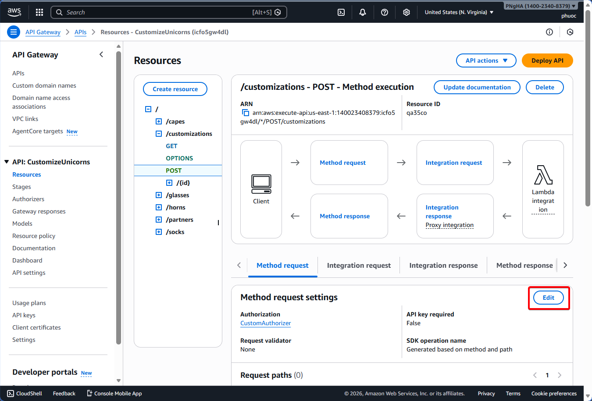
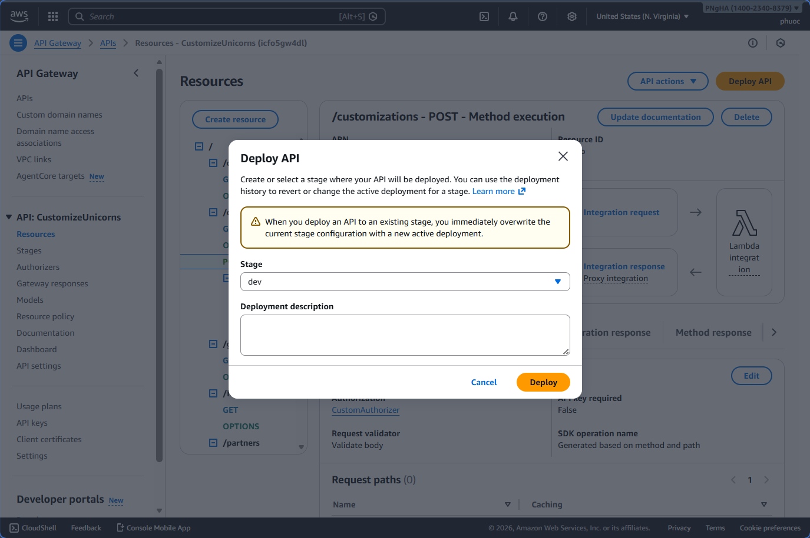
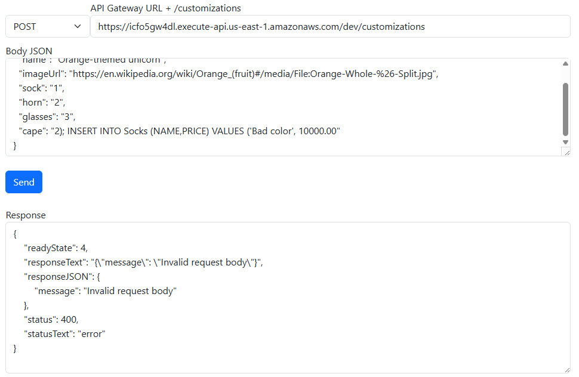

# Module 5: Input Validation on API Gateway

## Overview

1. Input validation is the most critical security control for web applications

  

2. API Gateway validates requests before invoking Lambda functions

3. Failed validation returns 400 Bad Request immediately

4. Invalid requests never reach your Lambda function

5. Validation results are logged in CloudWatch

6. This reduces unnecessary Lambda invocations and costs

7. Frees Lambda to focus on business logic rather than input validation

### Requirements for Customization Request

8. Customization request must include:
   - **name**: Customization name (required, string)
   - **imageUrl**: URL for cape image (required, valid URL format)
   - **sock**: Sock type ID (required, numeric)
   - **horn**: Horn ID (required, numeric)
   - **glasses**: Glasses ID (required, numeric)
   - **cape**: Cape type ID (required, numeric)
   - **company**: Company ID (optional, numeric)

  

1. Define JSON schema for API Gateway validation

2.  Specify required fields in the schema

3.  Add regex patterns for ID fields to enforce numeric values

4.  Set URL format validation for imageUrl field

13. Configure API Gateway to use the model for validation

  

14. Attach the model to the POST /customizations endpoint

15. Enable request validation on the endpoint

  

### Test 1: Valid Request

16. Open the API Client and create new partners

17. Navigate to Module 5: Input Validation section

18. Retrieve a valid partner token from new partners
  

19. Send invalid customization request:

  ```json
{ 
  "name":"Orange-themed unicorn",
  "imageUrl":"https://en.wikipedia.org/wiki/Orange_(fruit)#/media/File:Orange-Whole-%26-Split.jpg",
  "sock":"1",
  "horn":"2",
  "glasses":"3",
  "cape":"2); INSERT INTO Socks (NAME,PRICE) VALUES ('Bad color', 10000.00"
}
  ```

20.  Verify request succeeds with 200 response
    
21.  Verify SQL injection statement is effected in database

  

## Module 5A: Create Model

1. Open the [AWS API Gateway Console](https://console.aws.amazon.com/apigateway/home)
2. Click on the **CustomizeUnicorns** API
3. Click on **Models** in the left navigation
4. Click **Create model** button
5. Enter model name: `CustomizationPost`
6. Set Content type: `application/json`
7. In the Model schema field, paste the following JSON schema:

  ```json
  {
    "title": "Customizations",
    "$schema": "http://json-schema.org/draft-04/schema#",
    "type": "object",
    "required": ["imageUrl", "sock", "horn", "glasses", "cape", "name"],
    "properties": {
      "imageUrl": {
        "type": "string",
        "title": "The Imageurl Schema",
        "pattern": "^https?:\\/\\/[-a-zA-Z0-9@:%_+.~#?&//=]+$"
      },
      "name": {
        "type": "string",
        "title": "The name Schema",
        "pattern": "^[a-zA-Z0-9- ]+$"
      },
      "sock": {
        "type": "string",
        "title": "The Sock Schema",
        "pattern": "^[0-9]*$"
      },
      "horn": {
        "type": "string",
        "title": "The Horn Schema",
        "pattern": "^[0-9]*$"
      },
      "glasses": {
        "type": "string",
        "title": "The Glasses Schema",
        "pattern": "^[0-9]*$"
      },
      "cape": {
        "type": "string",
        "title": "The Cape Schema",
        "pattern": "^[0-9]*$"
      }
    }
  }
  ```

  

8. Click **Create** button
9. Click on **Resources** in the left navigation

10. Expand **/customizations** and click on **POST** method

11. Click on the **Method Request** tab

12. Click the **Edit** button in the Method execution section

  

13. Under Method request settings, click on **Request validator** dropdown

14. Select **Validate body** as the request validator

15. Click **Request body** to expand that section

16. Click **Add model** button

17. Set Content type: `application/json`

18. Set Model name: `CustomizationPost`

19. Click the **Save** button
    
  

20.  Click **Deploy API** button at the top right

  

21.  Select `dev` as the Deployment stage
22. Click **Deploy** to confirm

  


23.  Verify the API deployment completed successfully

  


## Module 5B: Testing

### Test 1: Missing Required Fields

1. Send a request with missing `sock` and `horn` fields:

  ```json
  {
    "name": "Cherry-themed unicorn",
    "imageUrl": "https://en.wikipedia.org/wiki/Cherry#/media/File:Cherry_Stella444.jpg",
    "glasses": "3",
    "cape": "4"
  }
  ```

  
  

### Test 2: Invalid URL Format

2. Send a request with an invalid URL format:

  ```json
  {
    "name": "Cherry-themed unicorn",
    "imageUrl": "htt://en.wikipedia.org/wiki/Cherry#/media/File:Cherry_Stella444.jpg",
    "sock": "1",
    "horn": "2",
    "glasses": "3",
    "cape": "4"
  }
  ```
  
  

### Test 3: SQL Injection Attack (Non-Numeric Value in Cape Field)

3. Send a request with a SQL injection payload in the cape field:
  ```json
  {
    "name": "Orange-themed unicorn",
    "imageUrl": "https://en.wikipedia.org/wiki/Orange_(fruit)#/media/File:Orange-Whole-%26-Split.jpg",
    "sock": "1",
    "horn": "2",
    "glasses": "3",
    "cape": "2); INSERT INTO Socks (NAME,PRICE) VALUES ('Bad color', 10000.00"
  }
  ```

  


### Correct parameters

4. Testing the POST /customizations API with right parameters:
  ``` json
  { 
    "name":"Cherry-themed unicorn",
    "imageUrl":"https://en.wikipedia.org/wiki/Cherry#/media/File:Cherry_Stella444.jpg",
    "sock": "1",
    "horn": "2",
    "glasses": "3",
    "cape": "4"
  }
  ```
  

---