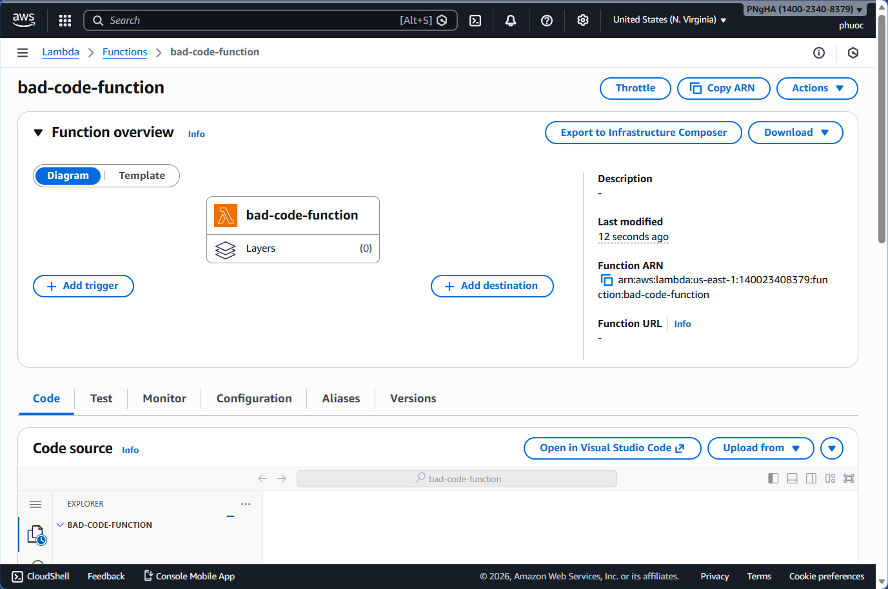

# Module 7: Amazon Inspector

## Overview

Modern distributed applications have many contributors, and sometimes developers write bad code. We have all seen this, right?

Wouldn't it be great if there was a service that assists development teams and identifies when code needs to be updated to reflect a set of security standards?

In this module, we are going to use **Amazon Inspector** to evaluate a few Lambda Functions that have been deployed and see how we can quickly update and mitigate risk.

### What is Amazon Inspector?

Amazon Inspector is a **vulnerability management service** that continuously scans your AWS workloads for software vulnerabilities and unintended network exposure.

Amazon Inspector automatically discovers and scans:
- Running **Amazon EC2 instances**
- Container images in **Amazon Elastic Container Registry (Amazon ECR)**
- **AWS Lambda functions**

For known software vulnerabilities and unintended network exposure.

For more information on Amazon Inspector services, check out the [Amazon Inspector Documentation](https://docs.aws.amazon.com/inspector/latest/user/what-is-inspector.html).

---

## Step 1: Setup Amazon Inspector

Setting up Amazon Inspector is very straightforward. Let's setup Amazon Inspector and configure the service to scan our Lambda functions.

### Navigate to Inspector Console

1. In the AWS Console, search for `inspector`

2. From the services menu, select **Amazon Inspector**

  

### Activate Inspector

3. Once the Amazon Inspector console page has loaded, click **Get Started**

4. When the Amazon Inspector Dashboard loads, click the **Activate Inspector** button

  

### Configure Lambda Scanning

5. Selecting the types of resources that we want Amazon Inspector to evaluate is done in **Account management**

6. Click **Account Management** to configure which resources to scan and evaluate

  

7. In the Account Management Setup screen:
  - Click the orange **activate** button
  - Check the mark next to **AWS Lambda Standard scanning + AWS Lambda Code scanning**
  - Click **submit**

  

  > **Note:** With this option enabled, Amazon Inspector scans for package dependencies and also scans your proprietary application code in Lambda for code vulnerabilities. The code scanning feature is only available in certain AWS Regions.

### Verify Activation

8. Once activation is complete, you'll see a green checkmark in the **AWS Lambda Scanning** column

  

---

## Step 2: Understanding Code Inspection

Amazon Inspector reviews the security and quality of the code written in your Lambda functions. To do this, the service uses the **Amazon CodeGuru Detector Library**, which has trained data across millions of code reviews, to generate findings.

### What Amazon Inspector Scans For

Amazon Inspector scans the Lambda function code to detect security flaws like:
- Cross-site scripting (XSS)
- Injection flaws
- Data leaks
- Log injection
- OS command injections
- Other risk categories in the **OWASP Top 10** and **CWE Top 25**

### Benefits

When you enable code scanning, you can focus on building your application while also following current security recommendations.

### Supported Runtimes

At the time of this writing, Amazon Inspector supports scanning:
- Java
- Node.js
- Python
- Go Lambda runtimes

For a full list of supported programming language runtimes, see the Amazon Inspector documentation.

---

## Step 3: Create Vulnerable Lambda Function

As a demonstration of the Amazon Inspector code scanning feature, let's create a simple Python Lambda function which accidentally overrides the Lambda reserved environment variables and also has an open-to-all socket connection.

### Create the Function

1. In the AWS Console, search for `lambda`

2. From the services menu, select **Lambda**

3. Click the orange **Create Function** button

  

4. Configure the function:
  - **Function name**: `bad-code-function`
  - **Runtime**: Python 3.11
  - Click the orange **Create Function** button

  



### Add Vulnerable Code

5. In the **Code Source** section, copy the code below and paste it into the code window, removing the example code provided

6. Click the **Deploy** button to save the code in the Lambda

  ```python
  import os
  import json
  import socket

  def lambda_handler(event, context):
      
      # print("Scenario 1");
      os.environ['_HANDLER'] = 'hello'
      # print("Scenario 1 ends")
      # print("Scenario 2");
      s = socket.socket(socket.AF_INET, socket.SOCK_STREAM)
      s.bind(('',0))
      # print("Scenario 2 ends")
      
      return {
          'statusCode': 200,
          'body': json.dumps("Inspector Code Scanning", default=str)
      }
  ```

  

### What's Going On Here?

**Issue 1: Overriding Reserved Environment Variables**
- Overriding reserved environment variables might lead to unexpected behavior or failure of the Lambda function
- You can learn more about this vulnerability by reviewing the Detector Library documentation

**Issue 2: Insecure Socket Binding**
- A socket connection without an IP address opens the connection to all entities, allowing the function code to potentially access public IPv4 addresses from within the code
- There can be external dependencies in your code which might reuse the insecure socket connection
- To learn more about insecure socket binds, see the Detector Library documentation

---

## Step 4: Review Inspector Findings

Let's dive deep and look at the results that Amazon Inspector generated.

### Access Findings

1. Back at the Inspector Dashboard, in the left navigation in the **Findings** section, click **By Lambda function**

2. Click on the **bad-code-function**

  

### View Summary

3. At the top of the finding window, you'll see a summary of the **Critical**, **High**, and **Medium** findings

  

### Review Detailed Findings

4. Scrolling down, you'll see the specific finding

5. Clicking on the tile will drill down and provide additional detail and remediation suggestions

  

6. Click on the tile and review the detailed suggestions

  

---

## Step 5: Remediate the Vulnerabilities

Now let's see how you can remediate these vulnerabilities according to the suggested remediation.

### Understanding the Issue

The code is attempting to change the function handler. AWS recommends that you don't try to override reserved Lambda environment variables, because this can lead to unexpected results.

### Fix the Code

For this case, we recommend that you comment out line 8 from the sample code and instead update the Lambda function handler name as outlined below:

**To change the Lambda function handler:**

1. In the Lambda console, search for and then select your Lambda function

2. Scroll down to the **Code Source** section

3. Comment out the line `os.environ['_HANDLER'] = 'hello'` with a `#`

4. Click **Deploy**

  

### Verify Fix

5. Amazon Inspector will automatically detect the changes that are made to fix the issues, and change the status of the finding to **closed**

6. By changing the findings filter to **Show all**, you can see active and closed findings

  

---