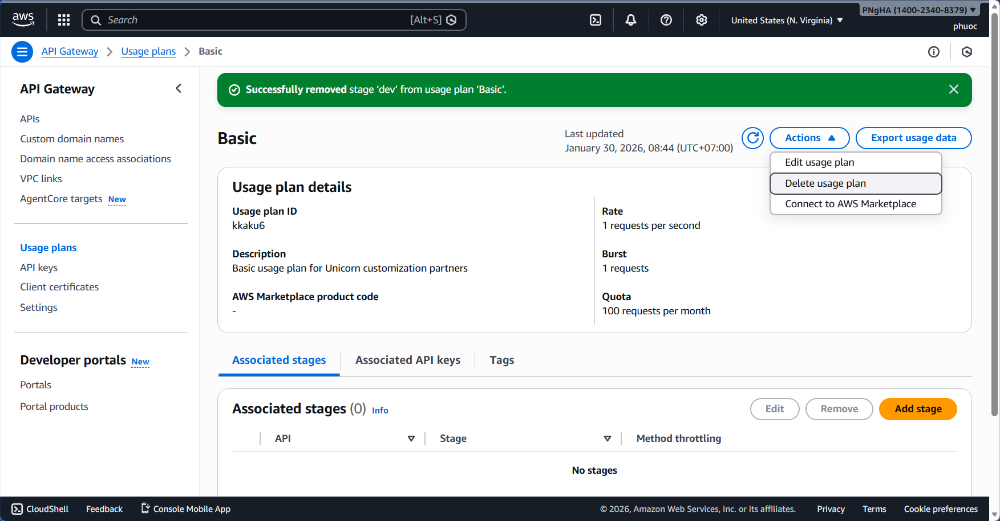
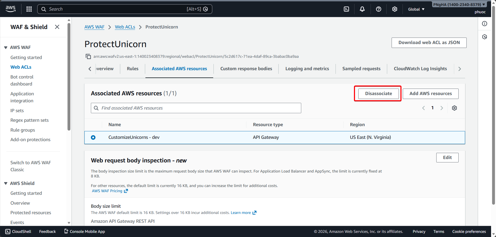
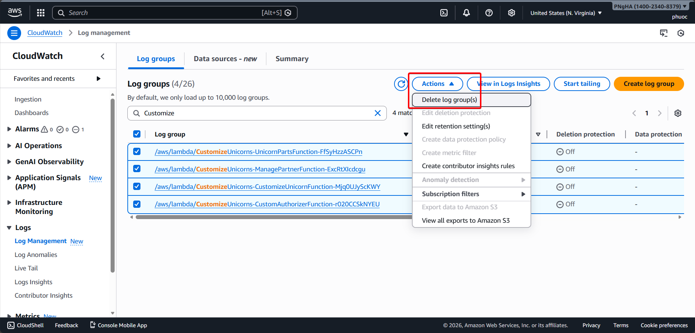

# Resource Cleanup

## Overview

Congratulations on completing the AWS Serverless Security Workshop!

This page provides instructions for cleaning up the resources created during the workshop. This is important to ensure you don't accrue charges in your AWS account.

> **Important for AWS Event Participants**: If you are running this workshop at an AWS event where accounts have been provided for you, you do not need to go through these cleanup steps as this will be automatically taken care of for you.

---

## Why Cleanup is Important

**Cost Prevention:**
- Running resources incur ongoing charges
- Lambda, API Gateway, RDS, and other services charge per usage or per hour
- Unused resources can accumulate significant costs over time

**Account Hygiene:**
- Keep your AWS account organized and clutter-free
- Easier to identify and manage active resources
- Better security posture with fewer attack surfaces
- Simplifies compliance and auditing

---

## Cleanup Checklist

Follow these steps in order to cleanly remove all workshop resources:

### Step 1: Delete Cognito User Pool Domain

If you created a Cognito User Pool domain in Module 1 (Authentication), delete it first:

**Using AWS Console:**

1. Navigate to [Amazon Cognito Console](https://console.aws.amazon.com/cognito/)
2. Select **User pools** from the left navigation
3. Click on your workshop user pool
4. Go to **App integration** tab
5. Under **Domain**, click **Actions** → **Delete domain**
6. Confirm deletion

---

### Step 2: Delete API Gateway Usage Plan

If you created a Usage Plan in Module 9 (Usage Plans), delete it:

**Using AWS Console:**

1. Navigate to [API Gateway Console](https://console.aws.amazon.com/apigateway/)
2. Go to Usage plans
3. Go to the Basic Usage Plan
4. In the Details tab under Associated API Stages, remove the CustomizeUnicorns API

5. On the upper right hand corner, click on Actions and choose Delete Usage Plan

---

### Step 3: Delete AWS Secrets Manager Secret

If you created a secret in Module 4 (Secrets), delete it:

**Using AWS Console:**

1. Navigate to [Secrets Manager Console](https://console.aws.amazon.com/secretsmanager/)
2. Select the secure-serverless-db-secret secret
3. In Actions select Delete secret
4. Enter 7 (minimum waiting period) for waiting period and click Schedule deletion

---

### Step 4: Delete AWS WAF

If you created a WAF ACL in Module 10 (WAF), delete it:

**Using AWS Console:**

1. Navigate to [AWS WAF Console](https://console.aws.amazon.com/wafv2/)
2. In the navigation pane, choose Web ACLs.
3. Choose the ProtectUnicorns web ACL you created in the module 6
4. On the Rules tab in the right pane, choose Edit web ACL.
5. Remove all rules from the web ACL by choosing the x at the right of the row for each rule. This doesn't delete the rules from AWS WAF, it just removes the rules from this web ACL.

1. Dissasociate the API gateway from the WAF by going to the section AWS resources using this web ACL in the Rules tab and clicking the x at the right of the API gateway stage

2. On the Web ACLs page, confirm that the web ACL that you want to delete is selected, and then choose Delete.

---

### Step 5: Delete CustomizeUnicorns CloudFormation Stack

Delete the main application CloudFormation stack:

**Using AWS Console:**

1. Navigate to [CloudFormation Console](https://console.aws.amazon.com/cloudformation/)
2. Select the CustomizeUnicorns Stack
3. Under Actions, choose Delete Stack

---

### Step 6: Empty the Deployment S3 Bucket

Before deleting the infrastructure stack, empty the S3 bucket:

**Using AWS Console:**

1. Navigate to [S3 Console](https://console.aws.amazon.com/s3/)
2. Search for bucket starting with secure-serverless-deploymentss3bucket
3. Click on the checkmark for the bucket and click on the Empty button

---

### Step 7: Delete Secure-Serverless CloudFormation Stack

Delete the infrastructure CloudFormation stack:

**Using AWS Console:**

1. Navigate to [CloudFormation Console](https://console.aws.amazon.com/cloudformation/)
2. Select the **Secure-Serverless** stack
3. Click **Delete**
4. Confirm deletion
5. Wait for deletion to complete (10-15 minutes)

---

### Step 8: Delete CloudWatch Log Groups

Delete remaining Lambda CloudWatch log groups:

**Using AWS Console:**

1. Navigate to [CloudWatch Console](https://console.aws.amazon.com/cloudwatch/)
2. Select **Log groups** from the left navigation
3. Filter for `/aws/lambda/` prefix
4. Select workshop-related log groups
5. Click **Actions** → **Delete log group(s)**
6. Confirm deletion

---

### Step 9: Delete RDS Snapshot

Delete the RDS snapshot of the aurora database created in the workshop in the RDS console

---

### Step 10: Delete Amazon Verified Permissions Resources

If you completed Module 3 (Verified Permissions), delete AVP resources:

**Delete Policy Store:**

**Using AWS Console:**

1. Navigate to [Amazon Verified Permissions Console](https://console.aws.amazon.com/verifiedpermissions/)
2. Select your policy store
3. Click **Delete**
4. Confirm deletion

---

## Verification Checklist

After completing cleanup steps, verify all resources are deleted:

**CloudFormation:**
- [ ] No CustomizeUnicorns stack
- [ ] No Secure-Serverless stack
- [ ] No VS-Code-Server stack

**Lambda:**
- [ ] No workshop Lambda functions
- [ ] No workshop-related log groups

**API Gateway:**
- [ ] No CustomizeUnicorns API
- [ ] No usage plans
- [ ] No API keys

**RDS:**
- [ ] No Aurora database clusters
- [ ] No database instances
- [ ] No snapshots

**Cognito:**
- [ ] No workshop user pools
- [ ] No custom domains

**Secrets Manager:**
- [ ] No db-credentials secret
- [ ] No workshop-related secrets

**WAF:**
- [ ] No ProtectUnicorn Web ACL
- [ ] No custom WAF rules

**S3:**
- [ ] No deployment buckets
- [ ] No workshop-related objects

**Amazon Verified Permissions:**
- [ ] No policy stores
- [ ] No policy templates

**CloudWatch:**
- [ ] No workshop log groups
- [ ] No custom dashboards

**EC2:**
- [ ] No bastion instances (if created)
- [ ] No workshop security groups (may be retained in VPC)

---

## Cost Estimation

Approximate costs for running the complete workshop (4-6 hours):

| Service | Estimated Cost |
|---------|---------------|
| Lambda (100K invocations) | $0.50 |
| API Gateway (10K requests) | $0.10 |
| RDS Aurora (6 hours) | $0.90 |
| Secrets Manager | $0.40 |
| Cognito (100 MAU) | Free Tier |
| WAF (1K requests) | $5.00 |
| X-Ray (100K traces) | $0.50 |
| CloudWatch Logs | $0.50 |
| S3 Storage | $0.10 |
| **Total Estimated** | **$8-12** |

> **Note**: Actual costs may vary based on usage patterns and region.

If your bill is significantly higher, you may have:
- Left RDS running overnight
- Generated excessive API traffic
- Missed cleanup of a costly service

---